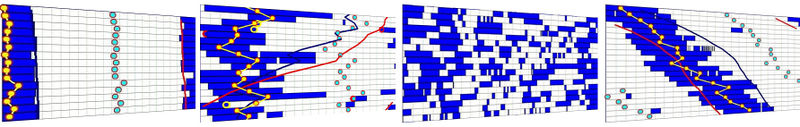
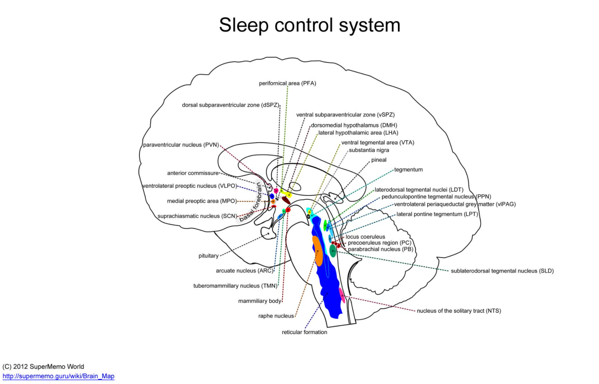
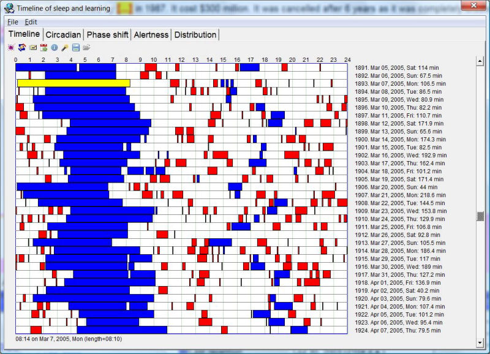

# 睡眠好，学习好，生活好
作者：[Piotr Woźniak](http://super-memory.com/english/company/wozniak.htm)
日期：2000 年 - 2018 年
来源：[Good sleep, good learning, good life](https://supermemo.guru/wiki/Good_sleep,_good_learning,_good_life)
翻译时间：2021 年 6 - 7 月

**警告：如果你通过 GitHub 在线查看此界面，格式将会完全爆炸，所有 inline HTML 均不能显示，且 anchor 均会失效，我推荐您首选将该项目 Clone 至本地，并使用 HTML 文件以获得最佳体验。详情参见：[格式选择](格式选择.md)。**

## 翻译的话 {#translator_s_words}

本翻译以 Markdown 语言写成，并导出成 HTML PDF PNG 等格式。推荐您使用 HTML 格式以获得最佳体验。

翻译并非 100% 准确。但我保证在我能力范围之内提供最好的翻译。如果您觉得有所讹误，可以提交 Issue，或者直接提交 PR。

对于英文 Wikipedia 链接，将替换或添加为对应中文 Wikipedia 链接（若有），并适当新增了外链。关于术语，请参见[术语](#glossary)一节。

译者推荐您先阅读[增量写作](#incremental_writing)一节，再看一下[参考](#references)和[术语](#glossary)前的声明。浏览[目录](#content)后，根据您的喜好，选读[概要](#summary)和[正文](#introduction)。您不必一天全部读完，也不必按顺序读，有兴趣的时候再读也无妨。

最后，感谢 Piotr Woźniak 博士在学习、记忆、睡眠方面的贡献。谢谢你！

---

##  目录 {#content}

[注释]: <> (对于原始 Markdown，该 TOC 需要搭配插件才能显示。)
[TOC]

## 1. 介绍 {#introduction}

二十多年来，我在[记忆和学习领域](https://www.supermemo.com/)深耕已久，因此我也对睡眠研究颇感兴趣。这篇文章致力于对已知的睡眠知识进行综合分析，以便于实际应用，特别是针对于那些需要高质量睡眠，以高效学习或获得创造性成就的人。睡眠神经生理学是一门正蓬勃发展的科学。基于新的发现，许多争议性理论将被废弃。届时，这篇文章的某些理论将会过时（相较于本文 [2000 年](http://super-memory.com/articles/sleep2000.htm)和 [2012 年](http://super-memory.com/articles/sleep.htm)的旧版本）。不过，基本事实都受到了广泛认可，并得出了对创造力及智力有参考价值的结论。本文中我提供了许多论文和流行的科学文章。它们可能会提出不同主张，甚至得出背道而驰的结论。建议广泛参考来源，保障认知全面。下文包括：使用自由运作的睡眠治疗失眠症的方法、进阶型睡眠周期障碍和睡眠相位后移症候群以及其他一些睡眠障碍的特征。此外，如果读者能对这篇文章提出建设性意见（尤其是学习和创造力方面），很高兴收到您的来信。

## 2. 睡眠的重要性 {#the_importance_of_sleeping}

### 2.1 优质睡眠的梦想 {#dreams_of_good_sleep}

清爽起床，愉悦地迎接新的一天，这是每个人的梦想。可悲的是，在当今社会只有少数人已经实现。但这并非说这不能实现，以下是实现的条件：

  1. 些许学识
  2. 愿意改变生活方式

对于第一点，但愿本文写尽了所需知识。至于第二点，俗话说，万事并非总能圆满如意，改变不是一蹴而就的。健康睡眠甚至会与现代生活习惯、渴求、生活方式相斥。进一步说，清爽睡眠可能会牺牲工作或长期目标。基于此，本文并非是解决所有人问题的灵丹妙药。再进一步，即使以上两点备齐，每一天都保持快乐和清醒的精神状态仍然是很难的。但让我强调一下：

<b>
对大多数人来说的大多数晚上，都能够安眠好梦。
</b>

这篇文章最初写于[十年前](https://www.supermemo.com/archives1990-2015/articles/sleep2000)。我一直对记忆、学习和睡眠感兴趣。此外，在我的工作中，睡眠就像氧气一样重要。随着我们深入到[信息时代](http://en.wikipedia.org/wiki/Information_Age)和[知识经济](http://en.wikipedia.org/wiki/Knowledge_economy)，这些问题对我们每个人来说都愈发重要。写完最初的文章后，我遇到了很多拥有睡眠问题的人。我亲眼目睹了这些睡眠知识对他们的帮助。以及人们在优质睡眠和追求高生产力路上遇到的种种障碍。我更见到了睡眠相位紊乱的病症，由此我对多相睡眠和一般睡眠问题的研究兴趣大增。尽管我恳求人们关闭闹钟，但对很多人来说这是不可避免的。在考试前通宵、把孩子[吵醒](#g_cry_it_out_method)去上学、睡觉前吃安眠药、把婴儿丢到床上哭着睡觉……如果不是知识给我带来了希望，这幅光景是相当震撼且可悲的。我相信，只要有决定，每个人都可以改善自己，和他们孩子的睡眠。

此文汇编了最重要和最有趣的睡眠生物学理论，以帮助你得到所需的知识，实现高质量的清爽睡眠，提高精神力量。这篇文章解释了为什么睡眠对健康和大脑极为重要。睡眠应该得到最高的尊重，如果大多数人只遵循规定的规则，就能获得良好的睡眠。

自从写了《[睡眠好，学习好，生活好](https://www.supermemo.com/archives1990-2015/articles/sleep2000)》（译注：2000 年版）一文后，睡眠科学迅猛发展。我在 [SleepChart](https://www.supermemo.com/archives1990-2015/articles/sleepchart) 和 [Supermemo](http://help.supermemo.org/wiki/SuperMemo) 等工具上的努力，为睡眠和学习带来了有趣的启示。我此前在一些琐碎文章和常见问答 (FAQ) 中讨论睡眠科学的发展，一些 Supermemo.com 的读者抱怨信息太碎片化了，而不是在一篇文章里写清楚。现在，我将其汇总于此。我想写一些使用的睡眠知识，但是同时，我也想探求鲜为人知的研究成果。这些成果或许可以对普通读者抑或是在睡眠、记忆、学习领域工作的科学家[有所启发](http://super-memory.com/articles/sleepchart.htm)。如果你觉得我遗漏了重要内容，[请告诉我](http://super-memory.com/english/company/wozniak.htm)。

因为我写得长得离谱，你可以从[底部的概要](#summary)开始读。如果你觉得摘要也很长，这里是要点：

- 尊重睡眠是获得高智商、良好学习的工具
- 自由的睡眠时间可以解决绝大部分问题
- 对创意工作者而言，[双相睡眠](#g_biphasic_sleep)是最健康的
- 不要叫醒孩子然后拉去上学；如果不能及时起床那就逃课或者考虑在家教育
- 让婴幼儿按需睡觉，可以考虑同床（尽管很多儿科医生有其他意见）
- 锻炼、学习、睡眠是促进大脑成长的最佳工具
- 避免使用药物调节睡眠或提高注意力，比如安眠药、酒精、非法药物、尼古丁、[咖啡因](#g_biphasic_sleep)。

### 2.2 理解睡眠 {#understanding_sleep}

太多人忽视了睡眠的重要性！在现代社会的家庭中，闹钟太常见了。由于电灯、闹钟、安眠药、轮班制等，现代人的睡眠往往是紊乱的。

<b style="color:#000">图：</b>4 例睡眠记录，可见现代人的睡眠模式如雪花般丰富多彩
 

在过去二十世纪的一百年里，我们侵入了一个经过数亿年演变，最终变得完美且精细的生理活动。然而，直到最近我们才发现。这种侵入可能是减缓工业化国家发展的重要的可预防因素。几年后，我们看到闹钟和「睡眠调节」的想法可能与我们看到香烟、失眠材料、放射性化妆品等其他「伟大」的人类发明别无二致了。

检查一下这张清单，里面哪些符合你的情况：

- 难以在正确的时间入睡
- 早上太困，起床很痛苦
- 在学习或工作时，感到困倦
- 和身体所需相比，时常缺少两到三小时睡眠
- 虽然用闹钟，但真的很讨厌闹钟
- 喝咖啡或者可乐
- 经常在早上睡两到四个小时懒觉
- 以上至少有一项是产生压力或者生产力下降的原因

我敢打赌，90% 的情况下，你至少有上述情况之一。可能这是你读这篇文章的原因。你或许已经习惯了，而且觉得无药可救。我会给出补救建议，但是，这需要你改变你的家庭生活、工作、老板或一些社会规则。

**睡眠，不仅仅是一种休息方式。** 睡眠是关键的生理功能，与智力发展密不可分。不尊重睡眠者难以焕发全部精神潜力。

现代社会的规则根深蒂固。睡眠被严重漠视。在美国，这已经近乎病态。以下，是一些破坏睡眠的做法：

- 用闹钟缩减睡眠，可行。
- 轮换制工作，可行。
- 跨国时不注意时差，可行。
- 少睡多做节省时间，可行。
- 早早地把孩子拉起来上学，可行。
- 大考前熬夜，可行。

少睡不会致人死亡（[至少不会立刻死亡](http://super-memory.com/articles/sleep.htm#If_you_do_not_sleep.2C_you_die.21)）。少睡使人痛苦，但再睡个好觉似乎就能轻松恢复。睡眠，好像很廉价。甚至，吉尼斯世界纪录也将不睡觉的尝试（1964年，[Randy Gardner](http://en.wikipedia.org/wiki/Randy_Gardner_(record_holder)) 持续 14 天没有睡觉），报告得轻描淡写。有些关于精神病学和心理学的书籍甚至表示，长期失眠没有任何明显副作用。显然，这是错误的。因为健康风险，吉尼斯世界纪录后来取消了[睡眠剥夺项目](#g_sleep_deprivation)。

1992 年，Bill Clinton 竞选美国总统。他骄傲地承认，他 48 小时没有睡觉，因为他真心想要成为总统。前参议员 Bob Dole 打破了纪录：「我已经坚持 78 小时没有睡觉了，必须坚持到 96 小时。我为美国昼夜不停地工作。」Dole 的壮举常和副总统 Albert Gore Jr. 相提并论。Gore 在 2000 年 11 月 7 日的选举日前坚持竞选三天。大选结束后，Gore 依然没有停息。在与 Texas 州长 George W. Bush 白热化竞赛的让步循环中加班加点。Obama 被问及当选总统一年多后，最想要的圣诞礼物时，他毫不犹豫地回答：8 小时的睡眠。

不尊重睡眠的坏榜样居然是对一个国家而言最重要的人。

有些与[睡眠剥夺](#g_sleep_deprivation)相关的戏剧性事实逐渐为人知晓。每年，睡眠障碍为美国国家医疗费用增添了 160 亿美元负担（例如，加剧高血压或心脏病）。这还不包括工作中的事故和生产力损失。为此，美国国家睡眠障碍委员会（the National Commission on Sleep Disorders）估计，[睡眠剥夺](g_sleep_deprivation)会导致压力增大、工作生产力下降，最终损失可达1500亿美元。[^1]40% 的卡车事故源于疲劳驾驶，午夜至早上 8 点的事故率增加了 800%。工业灾害也大多来自[睡眠剥夺](#g_sleep_deprivation)（Mitler 等人，1988[^2]），包括 Mile 岛、 Chernbobyl、Bhopal 的气体泄漏、Zeebrugge 灾难、Exxon Valdez 漏油事件。

自 20 世纪 20  年代以来，人们就知道睡眠能够改善学习中的[记忆](#g_recall)（recall）。然而，直到千禧年，Harvard 医学院的精神病学副教授 [Robert Stickgold](https://sleep.med.harvard.edu/people/faculty/220/Robert+Stickgold+PhD) 的研究才成为国际头条。他的研究证明了长期为人所知但鲜有人重视的事实：睡眠是学习的必要条件（Robert Stickgold 2005[^3]）。睡眠减少，记忆力随之下降。对于在本该睡觉的时间学到的知识，记忆留存率（recall）反而会大大降低。考试前熬夜确实有用，但在长期记忆（long-term memory）中留下的足迹却变得模糊。考试似乎已经取代了知识，成为了学习的主要目的。

减少睡眠后，学到得更少了，发展得更少了，头脑更不灵光了，决断愈发错误了，执行力愈发低下了，创造力愈发暗淡了，似乎做什么错什么，并且破坏了智力的真正潜能。

社会睡眠习惯的改变可以在学习、健康和生产力方面带来一场社会革命，其规模恐怕难以想象。「从历史角度来看，似乎要从根本上改变我们对睡眠的思考方式，用政策改革来保护社会，避免在工业和交通领域的灾难性错误。」（[Merrill Mitler](http://www.ninds.nih.gov/find_people/ninds/pdbio_merrill_mitler.htm) 博士）

我研究 SuperMemo 的用户数据已经 20 余年了。有几个决定性因素可以成为一个正面的、高效的、坚持不懈的学习者。以下特征是高级学习者可能具有的：

- 非常乐观
- 睡得好
- 求知若渴
- 抗压能力强
- 精力充沛，但在学习的时候能够放慢速度

很遗憾的是如果你有以下特征，那么和有效的学习能力可能八竿子打不着了：

- 时常有抑郁情绪、情绪波动大
- 睡眠问题（尤其是[失眠](#g_insomnia)）
- 压力大
- 多动、注意力不集中
- 抗压能力低（吸烟、饮酒、试图用物质改变情绪等）

睡得好似乎是学习成功的最重要因素之一!

## 3. 为什么要睡觉？ {#why_do_we_sleep}

### 3.1 睡眠的作用 {#role_of_sleep}

多年以来，睡眠的生理功能尚不明确。很多人认为，睡眠是用来休息、恢复精神的。睡眠的恢复性、保护性、能量保存理论一直相当流行。最近，人们发现，长时间睡眠和意识抑制似乎并不是进化中解决资源枯竭、废物排除或保存能量的最佳方式。例如，肌肉不需要完全关闭来休息。睡眠的关键功能在实验中得到了显著说明，长时间被剥夺睡眠的老鼠最终会在 2.5 周内死亡（参见：[不睡觉就会死。](https://super-memory.com/articles/sleep.htm#If_you_do_not_sleep.2C_you_die.21)）。

以进化角度看，睡眠是一个非常原始的现象，这说明睡眠对生存至关重要。只是在最近，人们才毫无疑问的证明了，睡眠机能与学习有关（[并非所有科学家都同意](https://super-memory.com/articles/sleep.htm#Not_all_scientists_agree)）

很久之前，研究者就认识到，小脑中的海马体对记忆形成的重要性。但是，一直都没有人阐明，它有别于大脑皮层其他区域的特殊之处。后者同样显示出突触可塑性，即存储记忆的能力。

在研究者的集体努力下，最终提出了睡眠中神经优化的理念（参见下一小节的比喻：[磁盘和内存](#disk_and_ram_metaphor)）。György Buzsáki 博士提出的突破性理论，记忆痕迹（memory trace）形成的两阶段模型，为我们解释了，睡眠中可能发生的事情（Buzsáki 1989[^4]）（注意不要与后文的记忆两构成模型（Woźniak 等，1995[^5]）和睡眠两构成模型互相混淆[^6]）。Buzsáki 利用他的神经网络知识（译注：此为生物学用语，请勿与计算机用语混淆）、对激发神经元的巧妙实验、对神经元在时间和空间上激发特征的复杂数学分析，提供了一个很好的模型，解释了两大睡眠组成部分，即 [REM](#g_rem) （快速眼动睡眠）和 [NREM](#g_nrem)（非快速眼动睡眠），如何共同优化记忆。海马体作为大脑的中央配电盘，可以轻易存储短期记忆（short-term memory）特征。然而，这些特征必须在新皮层进行编码，以便为编码的新短期记忆提供空间，这种重建大脑神经网络的复杂过程是在睡眠中进行的。与休息或保存能量不同，这一进化神经数学的最大壮举要求大脑完全关闭，不受环境输入的影响（在大多数动物中）。这种机能，是睡觉的主要原因和目的，所以睡眠过程中，我们没有清晰的意识。在睡眠时，大脑的工作强度并不亚于 SAT 或 GRE 考试时的表现。大脑重新排列记忆，以确保所有新知识都以最佳方式存储以供使用。

<b>
我们睡觉是为了让大脑能够整合新知识并形成新联想。由于我们必须通过睡眠使得大脑继续发挥其作用，我们的身体在睡眠中也附加了几十个重要过程。简而言之，清醒时，使用且燃烧；睡觉时，恢复且合成。睡眠影响到整个身体的功能和健康。
</b>

睡眠是由一组复杂的大脑核团控制的。对这个系统的干扰会破坏睡眠功能。参见：<a href="https://super-memory.com/articles/sleep.htm#Integrating_homeostatic_and_circadian_signals">睡眠控制系统</a>

参见：

- [在睡眠中的神经优化](https://super-memory.com/articles/sleep.htm#Neural_optimization_in_sleep)
- [不是所有科学家都同意](https://super-memory.com/articles/sleep.htm#Not_all_scientists_agree)

### 3.2 磁盘和内存比喻 {#disk_and_ram_metaphor}

该比喻可以帮助理解睡眠的职责，以及为什么闹钟是有害的：

比喻. <a href="https://supermemo.guru/wiki/Why_use_metaphors%3F" title="Why use metaphors?">为什么使用比喻?</a>

我们可以把大脑和 NREM-REM 睡眠周期和一台电脑相比。在白天，我们学习、遭遇新的事物，把新数据存在内存里。在晚上，先是 NREM，把数据从内存写入磁盘（译注：这里是磁盘，也就是 HDD 机械硬盘）。<a href="#g_nrem">NREM</a> 之后是 <a href = "g_rem">REM</a>，用于<b>整理磁盘碎片</b>，也就是组织数据，然后排序，建立新的连接等。于是晚上就会一直重复这个流程，直到内存数据全部被写入磁盘（保证长期使用），内存被清理，并为新的一天的学习准备就绪。醒来时相当于电脑重启。如果闹钟在重启之前响了，往往会让磁盘支离破碎（译注：可以类比成写入数据时断电）。读取速度很慢，思维一团乱麻。甚至，有些数据根本没有写入硬盘，和一开始就没有写入内存的结果是一样的。总之，<b>用了闹钟，就会危及数据。</b>

你可能不关心智力表现，但仍然有其他生物因素表明，使用闹钟并不健康。虽然使用闹钟并不会死。但这和吸烟、滥用药物、摄入过量肥肉的做法没有本质区别。许多发明源于昏昏沉沉的大脑。但是，没有什么能够比足够睡眠后，焕然一新的大脑更能改变未来。

### 3.3 不良睡眠会导致事故并造成严重损失 {#bad_sleep_kills_and_costs_billions}
睡眠剥夺是杀手。它导致飞机失事、核电站故障、汽车失事、石油泄漏等，杀死了宝贵的生命。[睡眠剥夺](#g_sleep_deprivation)可以改变历史进程。如果 Charles Lindbergh 未能从由睡眠不足造成的下沉中恢复 St. Louis 意志号，他将只是历史的一个脚注。睡眠不足改变了核裂变的未来和石油勘探的未来。睡眠不足在公路上造成的死亡人数与酒驾一样多。美国每年有 [1550 起死亡事故](http://drowsydriving.org/about/facts-and-stats/)可归因于疲劳驾驶。这相当于十年内发生的六起世贸中心大楼（译注：911 事件）倒塌的悲剧! 令人惊讶的是，由于痛苦和折磨在人群中被稀释，疲劳驾驶从来没有像恐怖袭击那样成为头条新闻。有三分之一的美国人至少有一次在方向盘后面睡着了！当夏令时切换时，汽车事故增加了 9%。[睡眠剥夺](#g_sleep_deprivation)给工业化社会造成了天文数字般的损失。在学校里，有数以百万计的时间浪费在非生产性的学习上，有数以百万计的人力时间浪费于徒劳地在床上辗转反侧。暴躁行为和情绪爆发也是有代价的。对于更好睡眠的追求激起了绝望的解决方案，如 [达·芬奇睡眠](https://super-memory.com/articles/sleep.htm#The_Uberman.27s_Sleep_Schedule)（Uberman 睡眠），「安全闹钟」装置，数百本书和成千上万的博客，其中有关于[快速入睡](https://super-memory.com/articles/sleep.htm#Insomnia)、早起或少睡的好建议。同时，真正的解决方案是简单而明显的！阅读本文的部分内容，并尝试一个月[自由运作的睡眠](https://super-memory.com/articles/sleep.htm#Free_running_sleep)。这能让你对睡眠的知识和生活潜力翻两倍。

我们需要尊重睡眠，让孩子们睡觉，设计更明智的夜班时间表，并尽量减少和死神打交道的行业（如，医疗行业）的[睡眠剥夺](#g_sleep_deprivation)。

在《经济学人》组织的睡眠剥夺辩论中，Karen M. 对结论这样评价：「我们没有足够的睡眠，我们也不会『做任何改变』。因为大多数人连维持爱好的时间都所剩无几。这是一个可悲的事实，但它真实存在。」尽管 Karen 试图代表所有人说「我们」，但这篇文章的读者多半不能被代表。否则，我就不会在这里写作了。优质睡眠使我们更完美、更聪明并且拯救生命。

参见：[之所以厌恶睡眠不足的 10 大原因](http://www.webmd.com/sleep-disorders/excessive-sleepiness-10/10-surprising-results) 来自 WebMD

## 4. 睡眠剥夺是致命的 {#sleep_deprivation_is_lethal}

### 4.1 不睡觉就会死 {#if_you_do_not_sleep_you_die}

几乎每个人都通宵过。尽管这是个不怎么愉悦的经历。但这种感觉总会在一晚稳固睡眠后消逝。因此，得知一两个星期的睡眠剥夺可能导致死亡，往往是令人震惊的。睡眠研究者搭建了一个残酷的装置，让小白鼠刚入睡就吵醒它们。这个装置表明，通过睡眠剥夺，只需要平均三周的时间就可以杀死一只小白鼠（或者通过 5 个月的 REM 睡眠剥夺）（Rechtschaffen 1998[^7]）。Siegel 博士证明了被睡眠剥夺的小白鼠的大脑损伤。（Siegel 博士，2003[^8]）由于糖皮质激素（glucocorticoids）的增加，大脑的某些部分的神经生成（neurogenesis），因为睡眠剥夺而抑制。[^9]简而言之，睡眠剥夺对大脑健康非常不利。

睡眠剥夺是一种广为人知的酷刑。由于伦理原因，小白鼠实验无法在人类身上复制（最终会导致死亡）。总之，通过对睡眠障碍影响的研究，我们对人类在睡眠剥夺状态下的最大限度有了一个大致的了解。其中一个例子是遗传性失眠症，在这种情况下，基因变异使得受影响的人患有逐渐恶化的失眠症，最终会在几个月内死亡。另一个例子是 Movan 综合症，免疫系统疾病破坏了神经元的钾离子通道，导致了严重的失眠和死亡（除非疾病得到缓解）。

你可能听到过对从不睡觉的人的报道。这些报道肯定有所讹误。说自己不睡觉的人，要么是在吹嘘，要么是对睡眠状态产生了幻觉，从而以为在睡觉的时候并没有睡觉。

### 4.2 大脑垃圾收集理论 {#brain_s_garbage_collection}

为什么睡眠剥夺最终是致命的？睡眠不足导致的死亡和老年正常死亡一样。很多时候，多重因素共同导致了最后的必然结果。或许没有人知道他的确切答案。但对睡眠的研究给了我们相当多的思路。

睡眠最重要的机能是重新组织正在休眠的大脑神经网络。（参见：睡眠中的神经优化）

在白天，我们学习新知，记忆，掌握机能，明晰事实，通过创造性联想建立新记忆。在醒来后漫长的一天中，大脑中充满了杂乱无章的记忆碎片。这些碎片需要和早前学到的知识融合起来。如果不这么做，大脑就会变成一团乱麻，没有新空间来储存新记忆。这种睡眠神经作用，是非常基本的，因此，睡眠剥夺会影响到几乎所有受神经系统支配的身体机能。如果没有定期的垃圾清理，单个神经网络就会出现故障。而后，故障会逐渐扩大，成为整个机体的严重问题。睡眠剥夺导致的常见影响包括：体温调节问题、免疫功能下降、激素变化（如，糖皮质激素 glucocorticoids 和儿茶酚胺 catecholamines 下降）、代谢变化、营养不良、幻觉、自律神经系统紊乱、细胞附着力变化、炎症因子增加（如 IL-6、TNF、C 反应蛋白等）、皮肤病变、氧化应激，DNA 损伤等。这些问题足以导致死亡。打个比方，如果我们把欠发达的生物体比作一台一战轰炸机，我们可以想象，它们进化成人的过程，就像获得驾驶 B-2 轰炸机所需的软件。尽管 B-2 轰炸机比莱特兄弟（Olive Wright）建造的飞机领先多年，但软件只要发生一个错误，就足以让它从天空坠下。睡眠不足的人体就像是 B-2 飞机的软件出现故障。可能技术上赶超他人，也或许表现卓越，但它却是脆弱的。对先进软件或神经的依赖总是危险的。但十分幸运，每天睡觉就可以消除这种危险。更多请参见：睡眠中的神经优化。

### 4.3 睡眠保护 {#sleep_protection}
睡眠剥夺还有第二层麻烦。因为睡眠十分重要，所以所有高级生物都具有睡眠保护程序。这保证了睡眠剥夺会导致令人不快的症状。还会产生强烈的睡眠驱动力，难以克服。保持清醒变得难以忍受。闭上眼睛变成了宇宙中最舒服的事情。这些症状是神经网络故障的结果吗？当然不是。如果是的话，睡眠的动力也可能出现障碍。此外，从睡眠剥夺中恢复也不会这么快、这么容易、这么彻底。睡眠保护程序是存在的，这使得睡眠剥夺的影响变得更剧烈。就像过度反应的免疫系统造成免疫细胞风暴一样，睡眠保护程序也有可能增加睡眠剥夺中对神经网络的损害。Michael Stryker 博士因证明睡眠在大脑发育中的作用而闻名（Stryker 等，2001[^10]）。他认为夜间荷尔蒙变化可能「在巩固和加强日间经历方面，充当重要作用」[^11]。睡眠剥夺中死亡的主要原因之一，或许因免疫功能下降（如无发热反应）而引起的机会性细菌感染。这种下降同样可能是因为：(a) 免疫功能的神经控制不佳 (b) 分解代谢过度（hypercatabolism）的直接影响。

### 4.4 睡眠中的新陈代谢 {#anabolic_sleep}
最后（也许不是全部），睡眠进化成了有机体新陈代谢的主要过程。没有睡眠，身体就会不断自我消耗，而没有时间重建。合成代谢状态并不需要关闭意识，但是夜间休息时，是进行重建的最佳时间。因为我们总要睡觉，所以这种合成代谢功能逐渐和睡眠的其他功能密不可分。合成代谢状态，以及夜间 GH 或睾丸激素的增加，也影响到神经网络和「精神软件」的状态。荷尔蒙的变化刺激或抑制神经成长。不管是什么原因，科学家们很快就发现，应用抗生素对这些感染的死亡没有什么帮助。睡眠不足的大鼠无论如何都会死亡。感染可能会加速原本不可避免的死亡。

### 4.5 为何不睡觉就会死？ {#why_do_we_die_without_sleep}
对长期睡眠剥夺造成的致命结果，这三个因素的影响度是不可量化的：
  
  1. 神经网络故障
  2. 睡眠保护程序的次生效应
  3. 持续的分解代谢状态

即使后两者有可能通过药物来补救，但对于睡眠中的网络重塑是无计可施的。希望找到对睡眠补救措施的研究人员，正在慢慢摸索。如果没有类似科幻小说中般的纳米技术，睡眠将在未来许多年里伴随着人类的发展（见：人工智能需要睡眠）。虽然睡眠不足会导致死亡，但睡眠是个好事。它使我们更聪明，我们应该拥抱健康的、无拘束的睡眠带来的好处。毕竟，度过一天后好好睡一觉，是再好不过的事情了。睡眠应该被列为基本人权之一。

## 5. 生物钟和恒常性睡意 {#circadian_and_homeostatic_sleepiness}

此节为 [Piotr Woźniak](https://supermemo.guru/wiki/Piotr_Wozniak) 的[《睡眠科学》](https://supermemo.guru/wiki/Science_of_sleep)（2017）的一部分。

### 5.1 睡眠的两大构成 {#two_components_of_sleep}

电灯和压力是将睡眠的自然过程变得痛苦不堪的罪魁祸首。新的一千年，我们难得希望获得优质的夜间睡眠，而不需要睡眠的科学和艺术。当今社会对睡眠功能的理解和 20 世纪 20 年代 人们对香烟危害的理解相差无几。大多数人试图用外力规制睡眠，用闹钟、毫无逻辑的轮班制、安眠药、酒精、咖啡因等，将疼痛、厌恶、精神酷刑强加于自己或自己的孩子身上。

**现在有一个机会，可以从不健康睡眠习惯的苦海中解脱出来，那就是理解睡眠规制的两过程模型。**

这是促使你上床睡觉的两大驱动力源：

- 生物钟组成（circadian component） - 当历经约一天后，睡意自然循环而来。
- 恒常性组成（homeostatic component） - 睡意随着醒来的时长逐渐增强。

只有将这两个部分都纳入考虑，才能决定最佳的睡眠时间。最重要的是，如果恒常性组成和由生物钟组成带来的强烈困意相违背，那么即使是由时间流逝导致的困意，也可能不足以获得优质睡眠。

### 5.2 生物钟组成 {#circadian_component}

已知有约一百个身体功能，在一天的周期里，于最大值和最小值间摆动。因为这些功能需要大约一天的时间来完成。生物钟（circadian）这个词是德国的 Franz Halberg 博士在 1959 年创造的。（在拉丁语中，*circadian* 意为「约一天」）。睡眠的总体趋势也受制于生物钟。一般而言，半夜困意最强烈，醒来时是最低点。在下午的午睡时间又轻微增加。但是与你期望的睡眠时间相比，生物钟的睡意总是有阶段偏移的。因此，如果在早上睡意最强烈，在晚上可能会难以入睡，即使你在前一天缺少睡眠。换句话说，你的最佳睡眠时间应该考虑到你的生物钟。

### 5.3 恒常性组成 {#homeostatic_component}

恒常性（homeostasis）是指，保持平衡或均衡的生理或代谢机能。如果你喝了大量含钙的液体，平衡机制将使钙随尿液排出，或者，存入骨骼，来保证血液钙平衡。类似地，也有机制用于调节整体睡意，该机制具有多个子组成部分。你保持清醒的时间越长，学习越多，思考越多，你入睡的倾向就越高。另一方面，咖啡因、压力、运动和其他因素可能会暂时减少你的恒常性睡意。恒常性机制保证你在漫漫一天的智力工作后安眠好梦。同时，防止你在紧急状况下入睡。

### 5.4 时钟和沙漏比喻 {#clock_and_hourglass_metaphor}

该比喻用于解释睡眠的两大构成（更学术化的解释请查看：Borbely 模型）。

比喻. <a href="https://supermemo.guru/wiki/Why_use_metaphors%3F" title="Why use metaphors?">为什么使用比喻?</a>

在大脑深处，你的生物钟正在运行一个约 24 小时的活动周期。每 24 小时，比喻地说，时钟就会释放一种令人入睡的药水。（详情参见：我们如何入睡）。如果你想在错误的时间入睡，没有睡眠药水，入睡是困难的。所有失眠者都因此而痛苦。如果他们在得到睡眠药水之前睡觉，他们通常会辗转反侧几个小时。你需要聆听你的生物钟，找到正确的入睡时间。

重要的是要知道，生物钟产生的药水并不足以让你入睡。大脑也有精神能量的沙漏，你每天都有一些时间可以用于智力工作。当你醒来时，沙漏是满的。而后慢慢流逝。随着每一个清醒的时刻，随着每一次大脑吸收信息，随着每一次的精神消耗，沙漏上层越来越少，下层越来越满。只有当精神能量的沙漏被清空时，你才能够迅速入睡。

要获得优质的夜间睡眠，你需要共同考虑两个因素：

<ul>
<li>你的生物钟必须对你说「快睡觉吧」（生物钟组成）</li>
<li>你的精神沙漏必须对你说「没力气工作了」（恒常性组成）</li>
</ul>

如果困意药水让你入睡，但是沙漏是满的，你会非常昏沉、疲倦，但是你睡不着。另一方面，如果你在精神沙漏是空的情况下，但是没有困意药水，你可能会成功入睡，但是你会很快起来，因为你的沙漏又满了。这使得你想再次入睡变得不可能。失眠症患者在生物钟释放睡意药水之前就会进入睡眠状态。当你被闹钟提前叫醒时，你几乎无法站起来，因为你的身体充满了睡意药水，它乞求你继续睡觉。当你在下午昏昏欲睡时，你的精神沙漏可能几乎是空的。这时，快速的小睡会帮助你再次填满它，并在晚上有很好的生产力。如果你在早上喝咖啡，它可以帮助你给沙漏充电，增加一些额外的精神能量。但咖啡与嗜睡药水结合，会产生一种有毒的混合物，将你的大脑吞没在病态的瘴气中。如果你试图通过喝咖啡来熬夜，你会觉得像被马踢了肚子。这是对你的大脑健康的顶级侵犯。

### 5.5 优质睡眠的基本定理 {#the_fundamental_theorem_of_good_sleep}
现在，我提出良好睡眠的基本定理：

<b>

要取得高质量的夜间睡眠，以最大化学习效果，你的睡眠时间应该遵循以下两点

<ul>
<li>强恒常性睡意：这通常意味着，不要早于醒后 15 - 19 个小时入眠。</li>
<li>强生物钟睡意：这意味着，当你觉得很快变得昏昏沉沉的时候，去睡觉。不早不晚！了解你的生物钟节奏的时机，对夜间优质睡眠是有很大帮助的。</li>
</ul>
</b>

注意，生物钟组成只有在其所有的生理学子组件同步运行时才会起作用（就像自由运作的睡眠一样）。睡眠时间不规律和生活压力大的人可能根本无法找到困意上升的昼夜睡眠点，因为这个点可能不存在! 关于生物钟和稳态成分的直观说明，见：SuperMemo中 的双构成睡眠模型一节。关于睡眠的两个组成部分的更多信息，见：Borbely 模型。

#### 5.5.1 什么时候可能不会有优质睡眠？ {#when_good_sleep_might_not_come}

你可能会惊讶地发现，你的内部生物钟稳态是更接近一个 25 小时的周期，而不是 24 小时！确切地说，它因人而异。更确切地说，它因人而异，因季节而异，也因其他日常因素而异，如压力、睡眠时间、光照时间、光照强度、运动等等。通常情况下，这个周期在 24.5 小时至 25.5 小时之间。

通过重置稳态的因子，大多数人都可以将 25 小时的生物钟诱导至 24 小时。这些因素包括强烈的晨光、工作、运动等。德国科学家将这些因素命名为「zeitgebers」（音：[ˈtsaɪtˌɡeːbɐ]，意为同步器）。由于众多 Zeitgeber 的影响，在一个适应良好的个体中，每天可以把周期推迟 30 - 60 分钟。然而，由于以下因素，许多人在适应 24 小时周期时可能会遇到困难：

- 失明（即不能通过主要的 Zeitgeber ——光，来重置稳态）
- 近视（即降低了对光的敏感性）
- 睡眠需求增加（例如因学习过度，高度创造性写作，运动等造成的）
- 压力
- 内分泌失调
- 睡眠障碍
- 青春期

许多睡眠障碍可以归因于诱导失败（即未能将 25 小时的生物钟重置为 24 小时一天的周期）。换句话说，睡眠障碍和诱导失败是相互作用的。他们之间的因果关系是时常颠倒的。由于睡眠的生理功能是将大脑神经网络重组，我们自然可以预期，对睡眠的需求与最近几天的学习量有关。这种联系也可以解释，退休了，智力活动减少后，睡眠需求的减少。这种与年龄有关的睡眠需求的下降，不太可能在大脑高度活跃的人身上看到。由于类似的原因，经常发现有在考试期间的学生诱导失败。目前还不清楚这种失败有多少是归因于压力，或在某一天做更多事情的愿望，又或是对睡眠需求的实际增加。

## 6. 优质睡眠公式 {#formula_for_good_sleep}

此节为 [Piotr Woźniak](https://supermemo.guru/wiki/Piotr_Wozniak) 的[《睡眠科学》](https://supermemo.guru/wiki/Science_of_sleep)（2017）的一部分。

### 6.1 自由睡眠是优质睡眠 {#free_sleep_is_good_sleep}

有一个鲜为人知的公式。对那些遇到持续或季节性的睡眠适应问题的人来说，该公式治疗效用完美。这个配方就是**自由运作的睡眠！**

自由运作的睡眠是指放弃所有形式的睡眠控制，如闹钟、安眠药、酒精、咖啡因等。自由运作的睡眠是指在常态性睡意构成和生物钟睡意构成相结合的情况下，在内部触发的时间，自然而然地进入睡眠。换句话说，自由运作的睡眠是在你真正困倦的时候才去睡觉（与这一时刻的绝对时间点无关）。自由运作时间表上的夜间睡眠持续时间，与身体需要的时间一样长，并以自然苏醒为终点。不允许有任何形式的睡眠干扰。特别是使用闹钟，这违反了自由运行睡眠原则。

自由运行睡眠的最大缺点是，它往往会导致一个循环超过 24 小时。这使得自由运作睡眠在社会上无法得到更广泛的应用。然而，如果你想尝试自由运作睡眠，你可以在假期中尝试。可能需要一个超过两周的假期，才能了解自己的生物钟周期。即使你不能在非假期的环境中负担起自由运作的睡眠，尝试一次，也会大大增加你对自然睡眠周期的了解，特别是你自己的睡眠周期。你还会知道，将一个人的睡眠诱导到所需的睡眠档次（如早起）是可能的。但是，诱导需要铁的自律和对诱导规则的虔诚遵守。

### 6.2 自由运作的睡眠 {#free_running_sleep}

自由运作的睡眠是指，不被人为控制以满足日程安排和欲望的睡眠。不需要安眠药抑或是闹钟。人类自存在起，就一直是这种自由运作的睡眠方式。我们的祖先被温和地鼓励在日落时入睡，然后好好地睡上不少于 8 - 10 小时后，自然地醒来（另请参见：分段睡眠）。对这一健康做法的背离，多半是因为文化、习惯、宗教和（或）传统的强加。虽然我们祖先的生活充满了危险、迷信、战争、疾病，但我们应该停下来思考片刻，对自然的、未曾变化的睡眠的惊人冲击在健康方面的影响。火、烛光出现并没有带来太大的熬夜激励，除了那些在晚上总是有很多事情要做的少数人：第一批书虫和艺术家。只有爱迪生等人才带来了真正的睡眠祸害：电力。随着印刷术和电灯的广泛普及，成千上万的人发现，夜间书远比睡眠更有趣。网络时代后，在公元 2012 年，无穷无尽的娱乐和吸引力太多了，引诱每个人离开床和健康的熟睡。越来越多的人想把睡眠挤进设计师的狭窄框架里。希望在一个特定的时间入睡，在一个特定的时间醒来。震惊的是，很大一部分人没有意识到这不可能，因为这对健康不利！所幸几乎所有人都有这样的直觉：睡眠对健康生活至关重要。那些想完全放弃睡眠的人只占极少数。几乎所有有创造力的人都希望醒来时精神焕发，准备就绪。最好是在指定的时间起来。同样的，大家希望在晚上睡觉前不那么累，并立即入睡。最好是在指定的时间入睡。**那就让我用黑体字说明吧：**

1. **想什么时候睡着就睡着，这不可能。**
2. **想什么时候起来就起来，这不可能。**
3. **想消除夜间睡意，这不可能。**

不管这多么令人失望，如果每个人相信我我陈述的事实，大家都能生活得更好。如果我们允许一个人在身体喜欢的时间自然醒来。那么从醒来的那一刻起，就是清醒的、愉快的。清醒的时候，精神能量的下降是不可避免的。这是自然的。在午间的注意力涣散也是不可避免的。而最佳的睡眠时间是几乎不变的。如果你欲图提前入睡，你可能会经历失眠。如果你欲图延后，你的睡眠时间会被削减，并可能在醒来之时毫无精神。如果试图比自然时间更早起来，例如使用闹钟，你多多少少被剥夺了睡眠，从而影响学习能力和创造力。不要被闹钟引起的，虚幻的注意力集中所蒙骗。虽然这发生在某些人身上，在某些时候，这加剧了一个传闻，即，被闹钟叫醒，可能会更清醒。

<b>
这是变得健康、拥有新鲜睡眠的唯一公式：累了就睡觉，不早，不晚。没有闹钟，自然醒来。
</b>

我将这个简单的公式称作**自由运作的睡眠**。对于很多人来说，经过多年的睡眠虐待，即使是自由运作的睡眠也相当棘手。需要一段时间来发现自己的规则并接受他们。如果入睡时间不超过 5 分钟（没有酒精、药物或者其他干预措施），在醒来时神清气爽，那么，你成功了，自由运作的睡眠正确执行了。早晨神清气爽的感觉不能被视为理所当然。即使是睡眠和生物钟相位的轻微偏移，也会失去这种感觉。经过几个月或者几周的混乱睡眠，一些生物钟变量可能在不同的周期进行，自由运作的睡眠不是一个瞬时的补救措施。可能需要一些时间来调节完善，以完成目标。甚至不能排除，经过多年的轮班工作或时差，睡眠控制中心的一些脑细胞可能已经死亡，良好的统一的清爽睡眠或许很难实现。除此之外，压力更是导致睡眠结构破坏主要因素。在自由运作的睡眠中，压力让你更晚入睡，需要相当长的时间才能入睡，而且更快地醒来了，远不如以前那么精神。为了长寿和生产力，对抗压力对每个人来说都十分重要。

伴侣和配偶可以在不同的周期实现自由运作的睡眠，但他们往往会惊讶地发现，与对方同步比与世界其他地方同步更容易（特别是，如果他们有类似的兴趣和日常生活习惯）。如果他们是同床共枕，这对夫妇中的一个通常会稍微早一点起床，并成为一个强大的 Zeitgeber 发挥效用。只有当两人自然偏好的睡眠周期长度相差很大时，问题才会出现。在这种情况下，另一个人并不作为 Zeitgeber，而是闹钟的替代品。

即使你不相信，你也应该试试自由运作的睡眠。这可以更好地理解睡眠相位的概念，以及睡眠相位是如何被各种生活方式影响的。你往往会发现，你所谓的睡眠障碍消失了。请注意，自由奔跑的睡眠期并不完全是遗传的。日常安排中的各种因素能够缩短或延长这个时期。晨间亮光或夜间褪黑素可能会缩短周期，这是比较明显的影响。晚上的刺激性活动会延长周期。周期随着季节的变化而略有变化。它也会在你离开度假时发生变化。它往往随着年龄的增长而变短。尝试自由运行的睡眠，了解自己的睡眠参数。这将帮助你与世界其他地方同步，或至少获得高质量的清爽睡眠。请在这篇文章中阅读更多关于自由运行睡眠的内容。扔掉闹钟并不是万能的。你可能需要学习一些关于睡眠的健康知识。

### 6.3 我们应该让睡眠自由运作吗？ {#should_we_free_run_our_sleep}

正如后面将讨论的那样，除了那些器质性疾病，从而破坏了自然睡眠机制的情况外。自由运作的睡眠能解决许多睡眠障碍。然而，你会经常听到两个反对采用自由运作睡眠的论点。

- **争吵 1** - 自由运作的睡眠会导致一天循环超过24小时。这最终导致在非典型的时间内睡觉。这似乎违背了自然界 24 小时的光与暗的周期。较少情况下，这个周期会少于24小时。
- **争吵 2** - 睡眠如吃饭。身体要求大于所需。这会导致多出不必要的睡眠时间。换而言之，自由运作的睡眠浪费时间。

#### 6.3.1 争吵1：相位偏移 {#argument_1_phase_shifts}

自由运作的睡眠常常和自然界的明暗周期相悖，这是正确的。然而，偏离自然节奏是使用电灯和进入现代生活方式的直接后果。我们的祖先在日落之后只能期待黑暗和无聊。长时间的黑暗和无聊在哄人入睡方面相当有效。如果我们顽固地，在夜间熄灯，我们仍然会发现很难从现代生活方式的兴奋中逃开。要想让你的大脑在傍晚时分高效入睡，你可能需要辞去目前的工作，挑选一些不令人振奋的工作，放弃紧张的家庭生活，放弃你的爱好和兴趣，放弃互联网、晚间电视，等等。我们的生活比我们的祖辈更有压力，也更令人兴奋。在傍晚时分关灯，可能只会造成浪费。此外，信息时代的病症——近视，使我们对光的敏感度降低，人为地延长了昼夜节律周期。自由运作的睡眠有很多缺点。最严重的缺点是，难以建立和其他活动同步的活动周期。通过自律地遵守周期重置规则，如晨练、明亮的光线、晚上的睡眠保护区等，稳定周期是可能的。

#### 6.3.2 争吵2：睡眠过剩 {#argument_2_excessive_sleeping}

诚然，在尝试自由运作的睡眠的开始，可能就睡得很久。然而，这在健康者身上不会持续，因为长睡眠是身体对因睡眠剥夺而导致的各种睡眠不足的反作用。与食物的情况不同，在我们有能力睡得更久的日子里，获得额外的睡眠似乎没有任何进化优势。在进化过程中，我们已经形成了一种暴饮暴食的倾向。这是为了防止食物匮乏的保护。脂肪组织成为了恶劣时期的生存工具。然而，考虑到睡眠的功能，对睡眠的需求应该在一定程度上与前几天接受的新知识量成正比。在古代，我们没有考试日与懒惰日之分。因此，学习和睡眠需求之间的联系是相当弱的。生物钟仍然会让我们在完全无为的日子睡 7 - 8 个小时。其次，每多睡的每一分钟，都可能提高大脑中神经线路的质量。睡眠最好比作喝水而不是吃饭。由于我们的储水能力差，我们没有多少能力在不喝水的情况下生存。同样，我们也不能提前睡觉，为考试或重要的死线前的两个通宵做准备。**自由运作的睡眠会增加对睡眠的自然需求，这种说法是错误的! 如果你碰巧在自由运作的睡眠中睡得更久，这表明你在之前就已经睡眠不足了。这种较长的睡眠阶段是短暂的。** 偶尔，如果你很早入睡，也会出现睡眠时间过长的情况。更多参见：过度睡眠。

在我看来，每个人都应该始终自由支配自己的睡眠，除非无法沿着自己选择的职业、专业、教育等路线在社会上发挥作用，或者无法照顾年幼的孩子。

#### 6.3.3 自由运作的睡眠毫无压力

有人提出，如果任何变化都是有压力的，那么接受自由运作的睡眠也会有压力。恰恰相反。也许在排除了最初的适应期后，对时间生物学了解较少的人犯了错误，可能导致他们的睡眠质量下降。但说任何变化都是有压力的，这概括过头了。每天更换 T 恤衫毫无压力。此外，变化的程度也很重要。同样的变化可以产生过度的压力，也可以成为生活中受欢迎的因素，这取决于其程度。让你的睡眠自由运作并不意味着任何程度的压力，除非自由运作的睡眠本身在你的日程安排中产生可能是压力来源。如果你在觉得饿的时候经常吃适量的饭菜，你可能会比在预先设定的午餐时间吃的时候经历更少的压力变化。自由运作的行为，顾名思义，使你的有机体自由地调整行为以适应身体的内部需要。因此，这些可以被认为是抗压因素。同样，睡眠、饮食习惯、运动等其他生理需求也是如此。

### 6.4 自由运作睡眠的算法 {#free_running_sleep_algorithm}

1. 从一个细致的日志开始，你将在其中记录你睡觉和早上醒来的时间。如果你在白天小睡，也要把它记在日志中（即使小睡时间只有1-3分钟）。该日志将帮助你预测最佳睡眠时间并提高睡眠质量。一旦你的自我研究阶段结束，你将积累足够的经验，不再需要日志；然而，你在开始时需要它来更好地了解你的节奏。你可以使用 SleepChart 来简化记录程序，帮助你知晓你的生物钟规律。
2. 只有在你真正累了的时候才去睡觉。你应该能够感觉到，你的睡眠入睡期可能少于 5 - 10 分钟。如果你没有信心在 10 - 20 分钟内入睡，就不要去睡觉！如果这需要你熬夜到凌晨，那就该如此。如果这需要你熬夜到凌晨，那就该如此!
3. 确保没有任何东西扰乱你的睡眠！不要使用闹钟! 如果可能的话，睡觉时不要有床伴（至少在自我研究期间）。避免噪音源和快速的灯光变化。
4. 避免压力，特别是在睡觉前时间。这在自我研究期间尤其重要，因为你仍然不确定你的最佳睡眠模式是怎样的。压力荷尔蒙对睡眠时间有很大影响。紧张的想法也有可能在你应该入睡的时候让你睡不着。
5. 在许多天后，试着弄清楚你的生物钟周期的长度。如果你得出的数字大于 24 小时，自由运作的睡眠将导致在每天都会更晚入睡。这最终会使你有时在白天睡觉。这就是为什么你可能需要一个假期来给自由运行睡眠一个诚实的测试。超过 24 小时的日子是相当正常的，你可以通过适当的时间信号，如光线和运动，来稳定你的模式。如果你是 DSPS 类型的人，这可能是非常困难的。
6. 一旦知道了平均清醒时间，每天计算一下你预计入睡的时间（我用预期上床时间和预期入睡时间来表示上床时间和入睡时间，在自由运作的睡眠中，这两个时间几乎是一样的）。这种计算将帮助你预测睡眠开始的时间。在某些日子里，你可能会在预计睡觉时间之前感到困倦。不要与困倦作斗争，即使这时离你预期的睡觉时间还有 2 - 3 小时，也要去睡觉。同样地，如果你在预期的睡觉时间不觉得困，那就不要睡，保持忙碌，晚点再睡，即使这时你的预期睡觉时间已经过了 2 - 4 小时。

#### 6.4.1 自由运行睡眠中容易犯的错误 {#cardinal_mistakes_in_free_running_sleep}

- 在你足够困倦之前不要入睡——这可能会导致入睡 10 - 30 分钟，然后醒来 2 - 4 小时。最终，你可以体验到在整个周期中人为的向前偏移！
- 除非是自然原因（没有困意），否则不要在预期的睡觉时间后很久才入睡。这将导致错过最大的昼夜节律困倦期。你的睡眠会更短，更不清爽。测量结果将不太规律，你会很难预测接下来几天的最佳睡眠时间。
- 不要在醒来后超过 7 - 8 小时才午睡。晚睡很可能影响预期的睡觉时间，扰乱你的周期。如果你在晚上感到困倦，你应该等到你确信能够整夜睡眠的时刻，然后入睡。

#### 6.4.2 睡眠记录的提示 {#sleep_logging_tips}

在自由运作的条件下，记录世纪睡眠时间应该不难。如果诱导失败，可能会很难入睡，或「分阶段」慢慢地起来。实际上，如果是自由运作的睡眠，你应该可以在 10 分钟内入睡，并立刻醒来（即没有一段睡眠惯性）。换句话说，你可以记住你上床睡觉的时间，加上 5 - 10 分钟，这就是睡着的时间。早上一睁开眼睛，你就应该记录清醒的时间。通常情况下，你不用怀疑自己是不是持续清醒（与临时清醒相对），并且不会再次入睡（这常见于非自由运作睡眠）。下图展示了一个记录自由运作睡眠的典范图表：

<i>

一个示范性的记录了 5 个月的自由运作睡眠周期图。在图中，夜间平均睡眠时间是 7 小时 5 分钟，午睡前清醒的时间是7 小时 48 分钟，平均午睡时间是 25 分钟，小睡和夜间睡眠前的时间是 9 小时 46 分钟。整个周期加起来是 25 小时 4 分钟。请注意，图中午睡和夜间睡眠之间的距离小于 9 小时 46 分钟，这是因为与红色的小睡线相比，蓝色的入睡线是指前一天的睡眠。因此，小睡到睡眠的时间段在水平方向上缩短了 64 分钟，也就是正好与周期中的每日相位移动一样多。

如果你用 SleepChart 收集了你自己的睡眠数据，如果你提交了数据，我非常感谢，这将有助于进一步的研究（从 SleepChart 发送数据只需要一次点击）。

</i>

## 7. 睡眠习惯 {#sleep_habits}

此节为 [Piotr Woźniak](https://supermemo.guru/wiki/Piotr_Wozniak) 的[《睡眠科学》](https://supermemo.guru/wiki/Science_of_sleep)（2017）的一部分。

### 7.1 众多睡眠习惯 {#constellation_of_sleep_habits}

在众多人口中，睡眠的习惯不计其数。这些差异之间又一个重要的生物原因。科学家们用「时间型」这个属于来区分不同个体的睡眠的入睡时间和持续时间。一个人的时间型可能是短睡者，另一个人的时间型可能是猫头鹰。然而，有些时间型会被诊断为睡眠相位障碍。尽管看起来种类繁多，但一组小的基本变量应该能让你相当容易地弄清自己的基本时间型。你的时间型可能决定你是否适合某些职业。幸运的是，在选择专业或工作之前，不需要确定你的时间型。许多人本能地倾向于符合其自然睡眠习惯的活动和职业。医生或消防员需要忍受轮班工作和中断的睡眠。挤奶工早起，而健身房或迪斯科舞厅老板需要熬夜，而作家可以是任何时间型的人，因为可以根据睡眠模式来调整自己的写作时间。为了说明个人的睡眠模式，我使用了一个叫做 SleepChart 的免费软件，你可以在这里下载这个软件来直观地描绘你自己的睡眠（Wozniak 等，2003[^12]）。如果你收集了几个月的数据，我将非常乐意收到你的数据文件，用于分析和未来的研究。您可以发送 SleepChart 数据，只需在程序中点击一下即可。

<b style="color:#000">图：</b>4 例睡眠记录，可见现代人的睡眠模式如雪花般丰富多彩
 

### 7.2 生物钟 {#habits_body_clock}

睡眠和清醒的循环是由生物钟控制的。生物钟主要在大脑的视交叉上核（SCN，suprachiasmatic nucleus）（参见专门的章节：SCN）。生物钟的周期约为 24 小时。在一天24小时中，有 5 - 10 个小时睡意浓郁，所以通常这个时候睡觉。在剩下的 14 - 19 个小时里，通常是清醒的，或者在午休。如前所述，只有一小部分清醒的时间适合做高质量的智力工作（参见：优化脑力工作的时间）。最集中的注意力可能只持续 2 - 4 小时。应该这样计划我们的一天：最大睡意袭来时睡觉，在注意力最集中的时候，进行注意力或创造力的活动。强迫身体和生物钟改变清醒和睡眠的时间是非常困难的，通常也是非常不健康的。反过来就很容易了：让自己的生活，适应生物钟所支配的自然周期。这种适应将取决于一个人自己的生物钟的独特属性。在下面的章节中，我将尝试告诉你，不同类型的睡眠习惯，是由哪些生物钟的个体特性决定的。

### 7.3 相位障碍中的睡眠组成 {#components_of_sleep_in_phase_discords}

有两大机制调整睡意（参见：睡意的两大构成）。一个是生物钟，另一个是“能量沙漏”。生物钟每 24 小时增加睡意，能量沙漏随着清醒时常而增强睡意（即，不睡觉的时间越长越困）。在睡眠研究中，这两种机制被成为睡眠倾向的睡眠倾向的生物钟（circadian）和恒常性（homeostatic）组成。

睡眠控制组成：
- **生物钟** - 每 24 小时制造一次睡意
- **恒常性控制** - 测量我们持续醒来的时间，并在足够时间后引发困倦

若受 DSPS 或 ASPS 病症影响，以下多个因素可能会影响在正常时间获得良好的睡眠。
- 生物钟周期和 24 小时相差太大。例如，DSPS 症状者可能为 25 - 26 小时。
- 生物钟周期对时间重置因素（本文称为 Zeitgeber）不敏感。正常人可由晨光和晨间活动来重置时钟。此外，夜间的黑暗环境和减少活动提供了重制时钟的效果。具有正常生活方式的人可以很容易地使睡眠与昼夜周期同步。
- 恒常性睡意组成具有较高的时间常数。若恒常性睡意组成较为敏感，可能会在苏醒后很快感到困倦。若不敏感，则可能倾向于长时间不睡觉。滥用咖啡因可能会使腺苷受体阈值提高，从而导致注意力快速下降（这将加速恒常性睡意的到来）
- 生活方式，对生物钟和恒常性睡意调节机制，均影响巨大。同一个人可能会在不同时期表现出不同的睡眠模式，这取决于：人工照明、运动、压力、兴奋活动的时间、午睡、饮食、气候、温度变化、健康状况等。

### 7.4 对百灵鸟-猫头鹰时间型的误解 {#lark_owl_misconception}

研究表明，有 15% 的人将自己归类为「晨间型」或者，百灵鸟。另外 20% 将自己成为「晚间型」或，猫头鹰。剩下的 65% 认为自己是一般的，或者「中间型」。你的类型是什么？你可能在网上接触过，百灵鸟-猫头鹰时间型测试。但这些测试都缺乏科学性，不能良好表现出你的遗传倾向。甚至，工作日的结果，可能也与自由运作时间表下的结果不尽相同。

时间疗法（chronotherapy）鲜为人知，该疗法可以让人适应完全不同的时间表（例如，每天将睡眠时间推迟 30 - 45 分钟）。如果要求一个典型的，猫头鹰型的人每天晚睡 30 - 45 分钟，他可能会把睡眠时间推迟。起初，他白天睡觉。睡眠时间会逐渐变得更晚。最后，他自己会发现入睡时间变成了早夜。这一切，仅仅是为了在百灵鸟型的人之前起床。即使是最执着的猫头鹰，可能之后也能舒服地长时间保持早起。对于入睡时间，人们几乎没有自然偏好。

然而，有一个因素促使人们相信，自己是某个睡眠时间型——生物钟周期的长度和适应 24 小时周期的能力。如前所述，典型的生物钟周期超过 24 小时。周期较长这倾向于每天更晚入睡。他们把起床时间强行限制到了早晨，这导致难以忍受的困倦。换句话说，周期长的人将倾向于在夜间工作，只要有可能，就在早上睡觉。

百灵鸟和猫头鹰型的人的睡眠时间喜好差异，并不是因为昼夜变化！差异更多地来自于生物钟周期的长短、对环境因素的敏感性，以及生活方式。你可以轻松地，让云雀型的人，舒适地工作到深夜；让一只猫头鹰，在凌晨 3 点起床。这可以通过时间疗法（周期调整）来实现! 此外，如果猫头鹰采用古代农民的生活方式（例如，放弃电力），在黎明时分起床是可能的。

一小部分人会经历短的生物钟时期，并会在夜晚开始时感到极度困意。这就是百灵鸟型。生活使得他们比自然光线提早入睡（家庭、工作、光线等），所以他们日出而作，日落而息。他们时常称，宁静的早晨，鸟儿的歌唱，美丽的日出唤醒他们。但是，强行让这类型的人改变睡眠时间，表现得像猫头鹰一样，也是可能的。

在现代社会，只有一小撮人拥有完全稳定的，自然的睡眠模式。这些人不仅仅是最健康的，也是自然的睡眠习惯的造物主。他们虔诚地遵循习惯，避免闹钟，避免晚间娱乐，避免睡眠药物，等等。与那些被良好规制的人不同，猫头鹰型在被偏移到晨间时间表后，会逐渐重回标准的深夜节奏。同样，百灵鸟型的人也会与鸟共同醒来。

相关研究表明，猫头鹰型（根据褪黑素的释放时间的分类）的智力商数表现略高于百灵鸟型。（Roberts 和 Kyllonen 1999[^13]）

### 7.5 记录并测量睡眠 {#charting_sleep}

理解控制睡意和清醒状态的身体机能，能够更加有效地理解睡眠习惯。在罹患睡眠疾病者中，尤其有用，特别是失眠症和相位偏移障碍。对生物钟变量的简单测量和简易时间疗法工具，或许帮助到低质量睡眠、入睡困难、入睡时间不正常的人。对时间生物学（chronobiology）的理解，可以避免危险的做法，如计划不周的轮班，不注意时差的健康后果，累积性的睡眠剥夺，和网红达·芬奇睡眠（Uberman sleep）。

为了阐明不同的睡眠习惯，我将使用由 SleepChart 绘制的表格。你可以在这里下载 SleepChart，之后就可以立马开始分析。你需要做的，就是在图中点选记录睡眠的始末时间。在 SleepChart 窗口的底部，显示有鼠标指针对应的精确时间。如果你记录错误了，选中后 Del 键删除即可。

基于 SleepChart 数据，我将解释健康的人无法获得清爽睡眠的主要原因：**睡眠相位问题**。

SleepChart 致力于精确描绘与生物钟低点（bathyphase）相关的因素，如最大睡意、低体温、低 ACTH（译注：促肾上腺皮质激素，adrenocorticotropic hormone）、高褪黑素等。基本假设是，您不会乱搞数据。每一个干扰都会降低 SleepChart 的准确性。这几点应该极力避免：

1. 用闹钟
2. 在夜间与睡眠抗衡（如，为了延迟睡眠）
3. 使用药物控制睡眠（如，酒精、安眠药，等）

在少数情况下，当你延迟睡眠或使用闹钟时，你可以用适当的标记改变对应的睡眠区块。但是，如果记录与实际不符，算法将失去准确性，结果会变成错误的甚至是完全相反的。此外，在确定入睡时间时，毋需遵循推算出的生物钟节律近似值，你应该优先考虑身体信号，即睡意，这同样很重要。遵循 SleepChart 的近似值会导致误差越来越大，形成错误的循环。换而言之，图表中的错误，会被你遵循图表的做法放大。这可能扰乱睡眠周期。在最坏的情况下，你可能会把自己误诊为 DSPS，但实际上并没有。你有且仅有的「入睡」标准应该是迅速增加的睡意。图表可以用来估测准备入睡的时间，以便「降温」。SleepChart 在用于治疗 ASPS 和 DSPS 的时间疗法中很有帮助，可以避免安排的日程与自然睡眠节奏相冲突。

得益于众多 SleepChart 使用者提供的数据，可以得出许多有趣的结论。最有说服力的，或许莫过于此：在年轻一代中，DSPS 可能正在迅速流行，在学生和从事高科技工作的人中尤为显著。这是环境差异越来越大的结果，我们祖先进化了几百万年的环境，与我们今天所处的，满布电灯、互联网、电脑、电视、无用奔波（rat race）的 24 小时社会环境，截然不同。生活方式和生物本能差距越来越大，导致许多人寻求激进的解决方案并采取猛烈的措施。有些人试图适应达·芬奇（Uberman）睡眠法，对它们的简易调查的结论十分有趣：尽管在一天中挤出更多清醒时间的想法十分吸引人，但大多数「实验者」开始对多相睡眠感兴趣，是因为获得不了清爽睡眠。

有些人对 SleepChart 的提升睡眠功用持怀疑态度：「太复杂了！奥卡姆剃刀（译注：即，如无必要，勿增实体。）该剃须了！睡眠如喝水如呼吸，吃饱了没事干又是画图又是实验，睡得还莫名其妙，是要干什么？如果只是为了在闭眼时更舒服，搞这么复杂一定脑子坏了——你得到的提升不过是心理作用罢了。」确实，睡眠在自然中自然地产生。但当我们面对咖啡因、酒精、尼古丁、人工照明、24*7 小时社会、夜间娱乐等干扰源时，麻烦就开始了。SleepChart 看似复杂，但对于担心自己有睡眠问题的人来说，这恐怕是预测自由运作的睡眠下的，最佳睡眠时间的，最简单方法了。SleepChart 只要求你录入自然入睡时间、自然醒来时间。所有的复杂运算全部由算法搞定。将近于用户什么都不用干，就可以预测生物钟节律相位和最佳睡眠时间。SleepChart 甚至可以把睡眠的恒常性组成和生物钟组成分开。了解这些也有助于规划健康的睡眠。

我同意，需要求助于 SleepChart 这样的工具是麻烦时代的标志。但 SleepChart 已经帮助人们理解了看似不规律的睡眠模式，并管理睡眠。有许多实际案例可以证明这一点。入睡可以是自然的，但许多因素会掩盖睡意或者放大睡意。对于睡眠时间不规律的人来说，难越鸿沟。

罹患睡眠障碍者很难被他人理解。「如果你每天辛勤工作 8 小时，吃三顿像样的饭，有正常的家庭生活，把别人当人看，那么晚上你理应安眠好梦。翌日同样清爽起床，精神焕发。这是人类自古以来的固有做法，未来也将这样。」这种对睡眠问题的态度，和对一个确诊抑郁症的患者说「振作起来」没什么区别，也类似于期待海洛因成瘾者戒断后，立马回归正常生活。如果有被失眠症折磨的患者被告知，不眠之夜来自于「不辛勤工作」、「不良的饮食」、「不恰当的家庭生活」、「不把人当人看」，他只会对自己更加不满。但是真正的问题是生理和现代生活方式的冲突。随着人工照明的到来，睡眠障碍的统计数据急剧上升。电视、游戏、互联网只会让情况超级加倍。手机、即时通讯出现后，失眠和睡眠相位障碍似乎达到了流行病的程度。更少的人能够放下工作，应对压力，或放弃晚上的活动。如果生活方式不做重大的改变，如果生物钟节律的控制方法没有重大突破，受睡眠障碍困扰的人将只有一个选择：即，继续忍受睡眠剥夺的痛苦，或，彻底激进的解决方案，如扔掉闹钟。当然，我们仍然可以期待科学的进一步发展，以解决这个问题。但在此之前，在工业化国家中，能享受「快乐地醒来」特权的人，仍然将越来越少。

#### 7.5.1 SuperMemo 中的 SleepChart {#sleepchart_in_supermemo}

为了分析睡眠和学习之间的关系，SleepChart 现已内置于学习增速软件 Supermemo。除了 SleepChart，也请让我简明扼要地介绍一下 SuperMemo。SleepChart 中与记忆有关的功能并不包含于先前单独发布的免费版中（译注：SuperMemo 15 现已免费，其中包含 SleepChart），因为没有学习数据可供参考。

基于**睡眠对学习不可或缺**这一认知，SleepChart 在几年前与 SuperMemo 合并。为了睡得更好，学得更好，有一点需要了解，即，自身的生物钟节律。SuperMemo 中的 SleepChart 就是基于辅助人们完成这一目标而设计的。可以帮助你的睡眠时间，帮助优化你的学习时间。此外，你也可以选择提交睡眠和学习数据以助于分析，在睡眠对记忆的影响的研究中做出自己的贡献。你可以通过以下方式访问 SuperMemo 中的 SleepChart：(1)主菜单上的 工具（Tools）：SleepChart (2) Supermemo Commander（指令中心） (3) 直接按 F12

睡眠区块为蓝色。学习区块为红色。右侧为每天的总学习时间。被选中的睡眠区块为黄色，该区块的时长显示在底部。

在 SuperMemo 中，会自动生成学习时间线。当你使用 SuperMemo 做重复练习时，会自动添加甲学习区块（图中以红色表示）。此外，睡眠数据需要手动录入（图中以蓝色表示）。在最低限度的理解下，你可以查看学习和睡眠时间的基本视觉信息。然而，更高级的功能，如优化学习时间和睡眠时间，需要使用高级分析功能，并对生物钟节律有足够的理解。如果你今天开始记录睡眠数据，你讲使用到更先进，更高级版本的 SuperMemo 来理解和研究你的睡眠和学习。

#### 7.5.2 睡眠记录 {sleep_log}

SleepChart 的睡眠时间线需要手动记录。记录时，先点击区块的开始（睡眠开始），然后再点击区块的末尾（睡眠结束）。你也可以先点击区块的末尾。不允许超过 22 小时睡眠块。睡眠块不能与其他时间线重叠（你不能边用 SuperMemo 学习，边睡觉）。如果你在单独的免费版 SleepChart 程序中收集了睡眠数据，你可以使用 **File : Import : SleepChart file** 迁移 SleepChart 数据至 SuperMemo（也可以导入电子表格）。同时，你可以用 **File : Verify : Block overlaps** 防止区块重叠。防止区块重叠是在 SuperMemo 中使用 SleepChart 的一个重要优势。相对于独立的 SleepChart 来说，后者很容易在录入数据时掉链子（例如一个月后才注意到缺失了一天的数据）。你可以标记强行延迟的睡眠区块，也可以标记因闹钟或其他因素而缩短的区块。请注意，如果你不人为地调节睡眠（例如用闹钟、安眠药等），你可以得到最好的分析结果。应用模型不会完全考虑到人工干预。最后，且十分重要的是，自然睡眠是你在学习中应该追求的目标，也是追求健康和幸福的最大来源。

#### 7.5.3 睡眠和学习时间线 {#sleep_and_learning_timeline}

将睡眠时间线与从 SuperMemo 中的学习数据相结合，开启了一系列新研究和优化可能性。

右边显示每天各自的睡眠统计信息。勾选工具栏上的合并按钮，可以合并睡眠块。例如，在夜里醒了 5 - 10 分钟，合并将使 SuperMemo 把夜间睡眠视作整体。短暂的夜间苏醒是常态，即使我们没有意识到，对学习也没有什么影响。合并睡眠快可以揭开睡眠重要特点（例如，见对夜间睡眠的偏好）。这有助于将连续的多个睡眠块表达为一段高睡眠倾向的时段。

除了睡眠统计信息，最佳入睡时间也可以被 SleepChart 估算。通过两个独立模型，可以预测夜间中间点和预期最佳入睡和苏醒时间。估算值有助于优化轮班工作者或不规律的睡眠。例如，之前一周睡眠都很混乱，因此很难确定最佳入睡时间。睡得太早可能会导致早醒（者往往会完全毁掉夜间睡眠）。睡得太晚可能导致夜间睡眠时间短，睡眠不足，以及第二天的注意力降低。根据睡眠史预测的最佳睡眠时间并非精确，两种模型亦可能产生不同结果。重要的是！自然本能应该远远优先于数学模型。此外，在自由运行的睡眠中，才会得出最佳的，优化睡眠的结果。如果用闹钟，或熬夜，或服用安眠药，这些模型可能无法充分理解睡眠控制系统的混乱变化。

连续的蓝线和红线是使用 SleepChart 模型基于睡眠史的，对最佳睡眠时间的预测。黄线
为使用相位反应曲线预测的生物钟睡意的最大值（生物钟的午夜睡意顶峰）。请注意，从理论上讲，黄线应大致落在蓝线和红线的中间。然而，当睡眠模式被严重破坏时，这些线可能会出现分歧，这证明了一个事实，很难建立在睡眠控制系统受到重大干扰时，完全匹配混乱行为的模型。灰色的点指向估测的日间注意力的下降点（即此时小睡大概最有成效）。

#### 7.5.4 生物钟节律图像 {#circadian_graph}

SleepChart 中的生物钟节律图能让你更好地了解自己的睡眠模式，也可以直观地看到周期的不稳定程度（即你的睡眠-觉醒周期对 24 小时周期的适应度）。你需要几个月的数据才能使图表变得有意义。此外，睡眠日志中的主观夜间近似线会有大量的滞后现象。如果你的生活方式发生了巨大的变化（例如，由于治疗的结果），你可能需要几个星期的时间来使近似线与数据正确对齐。这样，昼夜节律图可能就更难解释了。在这种情况下，你可以使用「**开始时间**」和「**结束时间**」选项来划分特定区间。这样可以将分析限制在某个生活方式的特定时期。

单相睡眠者的生物钟节律图示例。

##### 7.5.4.1 入睡 {#sleep_initiation}

<b>蓝线表示首选的入睡时间。</b>这与睡眠倾向相对应，睡眠倾向由每天特定的入睡时间的数量得出。横轴上的 0 指的是醒来的时刻。右侧纵轴显示的是在某个特定时间入睡的百分比。蓝线大致表达了你的「清醒疲劳度」。它也表达了你入睡的能力。最佳入睡时间是个人特征，在人与人之间有所不同。对多数人而言，最佳入睡时间在醒来后第 16 - 20 小时之内。在这个例子中，最佳入睡时间在醒来后的第 18 个小时。

##### 7.5.4.2 睡眠维持 {#sleep_maintenance}

<b>红线表示睡眠的平均时长。</b>这条线粗略地表示了维持睡眠的能力，即，最长的睡眠时间发生在主观而言的夜间。左侧纵轴为睡眠的平均长度。这张图表明，即使你能在日间入睡，也不能维持很长时间。在多数常规睡眠者的情况下，只有在醒后第 11 - 14 小时，睡眠时长才会增加。请注意，睡眠长度图在参考首选的睡入睡时间时有轻微的相位偏移，这是因为长睡眠大多需要稍提早入睡。

##### 7.5.4.3 优化就寝时间

如果你想确定你的最佳睡眠时间，在蓝线中找到夜间峰值，并选择附近的点，该点需对应足够长的睡眠（红线足够高）。此外，要注意，清醒时间和睡眠时间加起来应该是 24 小时，否则将会出现相位偏移。

有些人在白天会小睡。其他人则不这样做。对于午睡者，蓝线也应该指向中午最大的注意力下降。短暂的午睡时间实际上可能是一个良好的午睡时机的标志，只要参照蓝线，午睡时间不要太早（参见：最佳午睡时间）。不打盹的人也会在第 7 个小时左右经历睡意高峰，尽管他们的蓝线不会显示出突出的隆起。

如果图表显示你的最佳午睡时间是在第8个小时，而你在早上6点醒来，你应该在14点左右（下午2点）休息一下，找一个僻静的地方休息几分钟。你也可以将你的午餐安排在 13:00 - 13:30 左右，以营造完美的午睡环境。

##### 7.5.4.4 实例 1：不稳定生物钟周期 {#exmaple_1_unstable_circadian_cycle}

在下图的示例中，平均而言，醒后第 18 小时入睡可以获得最佳夜间睡眠（假设数据没有被任何形式的人工干预所影响，如闹钟、延迟睡眠）。蓝线显示，醒后第 18 小时是入睡的首选时间，而睡眠的长度（红线）加起来是 24 小时的睡眠-醒来周期。

由于蓝色曲线的两个高点高度相同，我们可以得出结论，该图记录的是一个虔诚的午睡者，其最佳午睡时间在醒后第 7 小时。所以，对于早上 8 点醒来的人而言，午睡应该在下午 3 点开始，而夜间睡眠则在凌晨 2 点左右。对于这两个高峰，7.4% 的睡眠时间在最佳时间，而其余 85% 的睡眠时间是次优的。

在第 16 小时入睡可以达到最大的睡眠长度。然而，这并不表明这是最佳的睡眠时间。如果入睡过早，可能会，也可能不会经历夜间（主观而言）的生物钟低点。换而言之，睡了几分钟可能就会醒来。醒来后很难再次入睡，这是失眠的主要原因。再次入睡之所以困难，是因为睡眠过程中常态性睡意倾向会迅速丧失。此外，在生物钟低点前入睡似乎并不比稍后的较短的睡眠更有价值。例如，早晨精神焕发的主观感受反映出来，或通过多导睡眠图（polysomnographically）测量。蓝色的恒常性睡意曲线表示更有可能在第 18 小时更有效地开始睡眠，而平均长度为 6 小时。如果数据没有人为干预。那么该曲线的第二个峰值即为最佳入睡时间。该图还表明，如果睡眠推迟一小时，时长将缩短 10 - 30 分钟。并且，这一点点削减亦可能影响日间表现。如果提前一小时，时长亦会延长 10 - 30 分钟，但质量并非成比例增加。

该图亦显明，**生物钟周期的长度如何，由就寝时间决定**。绿线显示了一系列平衡点，表示最稳定的 24 小时睡眠-苏醒周期，即，睡眠时间和醒来时间约合为 24 小时。所有位于绿线右侧的生物钟图点均会导致相位延迟。反之，会导致相位提前。灰蓝线表示 24 小时周期绿线和睡眠长度红线的交点。由于绿红之间的角度很大，此类睡眠模式相当不稳定。即，在第 18 个小时前入睡会导致周期少于 24 小时，而在其之后会延长周期且延迟相位。例如，早睡（约第 15 小时）将导致周期为 21 小时（横轴上的第 15 小时对应从红线读出的平均睡眠时间 6 小时）。较晚的入睡时间（大约第18个小时）将产生一个完美的 24 小时循环，而熬夜（例如第 20 小时入睡）将造成一天持续 25.5 小时。自然，最好避免所有对一天长度的操纵，因为早睡会增加失眠的机会，而很晚睡则会提高睡眠剥夺和 NREM 减少的可能性。了解一个人的睡眠偏好，对于轮班制或克服长途飞行中的时差很有帮助。

#### 7.5.4.5 实例 2：稳定生物钟周期 {#exmaple_2_stable_circadian_cycle}

#### 7.5.4.6 相位偏移混乱 {#phase_shift_disorders}

### 7.6 24 小时睡眠周期 {#24_hour_sleep_cycle}

### 7.7 夜间睡眠偏好

## 8. 双相睡眠生活 {#biphasic_life}

## 9. 优化脑力工作时间 {#optimum_time_for_brainwork}

## 10. 闹钟 {#alarm_clock}

## 11. 健康午睡 {#healthy_siesta}

## 12. 午睡的最佳时间 {#best_time_for_siesta}

## 13. 有关小睡的传闻 {#napping_myths}

## 14. 影响睡眠的因素 {#factors_that_affect_sleep}

## 15. 该睡多久？ {#how_long_should_we_sleep}

## 16. 婴儿的睡眠 {#baby_sleep}

## 17. 失眠 {#insomnia}

## 18. 起床气（睡眠惯性/惰性） {#sleep_inertia}

## 19. 轮班制和时差 {#shift_work_and_jet_lag}

## 20. 睡眠呼吸障碍 {sleep_apnea}

## 21. 嗜睡症 {#hypersomnia}

## 22. 睡眠相位后移症候群（DSPS） {#delayed_sleep_phase_syndrome}

## 23. ASPS {#advanced_sleep_phase_syndrome}

## 24. 治疗 DSPS 和嗜睡症 {#curing_dsps_and_insomnia}

## 25. 测量睡眠阶段 {#charting_phase_shifts}

## 26. 分段式睡眠 {#segmented_sleep}

## 27. 睡眠的功能 {#function_of_sleep}

## 28. 睡眠和学习 {#sleep_and_learning}

## 29. 如何入睡 {#how_do_we_fall_asleep}

## 30. NREM 和 REM 睡眠 {#nrem_and_rem_sleep}

## 31. 睡眠中的神经优化 {#neural_optimization_in_sleep}

## 32. 争论记忆优化的科学家们 {#scientists_who_contest_memory_optimization}

## 33. 生物钟振荡器基因 {#circadian_oscillator_genes}

## 34. 传闻和事实 {#myth_and_facts}

译注：原题 Myth and Facts，myth 一词直译神话，此处更接近传闻/误区/谣传。为规范，此词均作「传闻」，尽管有时不甚符合语境。

### 34.1 睡眠时长 {#myth_length_of_sleep}

1. **传闻：应该每晚睡正好 8 小时。事实：** 一些人可以睡得更少，他们不必执着于 8 小时。另一些人需要多于 8 小时。我们应该睡我们睡眠系统所需的量。欲图达成 8 小时的精确处方，可能会导致失眠症或者睡眠剥夺。
2. **传闻：睡得越少，活得越久。** 2002 年，Kripke 比较了睡眠时间和寿命的关系（1989 年癌症风险调查问卷的数据）。他发现那些睡 6 - 7 小时的人比睡 8 小时以上的人更长寿。于是有传闻说睡得更少的人活得更久，这不足为怪。**事实：** 最长寿的人是通过顺应自己身体的节奏来睡觉的。那些坚持自己良好节奏的人，往往睡得更少，因为他们的睡眠结构更好（因此更清爽）。「自然睡眠」的人寿命更长。那些违背自己身体规律睡觉的人，往往需要更多的时间，并且感觉浑浑噩噩。此外，疾病往往与睡眠的需求增加有关。感染性疾病对睡眠的巨大影响是人所共知的。当处于昏迷状态时，当然不会长寿。要分清楚相关性和因果性。
3. **传闻：感觉困倦是因为没有睡够。事实：** 有些因素比睡眠的长度更影响精神是否清醒。同样的人，基于不同的情况，可能经历 3 个小时的优质睡眠，比一晚劣质睡眠更有精气神。造成日间嗜睡的主要因素是：使用闹钟、错误的入睡时机（要么太早，要么太晚）、睡眠呼吸障碍、使用安眠药或酒精诱导睡眠、滥用化学物质。
4. **传闻：身体总是渴求过量睡眠，如同渴求食物一般。** 很多人把适量睡眠和过量睡眠画上等号。认为如果身体会说话，那么身体一定会要求过量睡眠。于是，这些人倾向于使用闹钟削减睡眠，以「优化」睡眠量。**事实：** 不像储存脂肪，额外的睡眠并没有进化上的益处。也许，常见的 6 - 8 小时睡眠仅仅是刚好满足「做精神家务」罢了。睡眠不足的人确实倾向于倒头大睡到天荒地老。然而，一旦他们的生物钟适应并恢复。睡眠时间是有可能减少的。
5. **传闻：睡得更少能成为卷王。** （原文是 more competitive）有的人非常忙，每天只睡 3 - 4 小时。进一步地，他们认为睡得更少，竞争力更高。并尝试训练自己，将睡眠最小化。Donald Trump 在他最新的书中，这么说：「如果你想成为亿万富翁，睡得越少越好。」**事实：** 天才人物睡得少是事实。很多商业大腕睡得还要少。但是，要最大化长期竞争力，唯一的公式是最佳的健康、最大的创造力。假设 Donald Trump 每晚上睡 3 小时还享受工作，他很可能是靠警惕性激素（ACTH、皮质醇 cortisol，肾上腺素 adrenaline 等）支撑的。他的睡眠结构可能非常好，他每小时的睡眠可能比一般的每晚 8 小时的睡眠者获得了更多的神经益处。然而，这不应该使你试图用闹钟来约束自己的行动。只有当你完美地达到生物钟低点时，即当你的身体告诉你「现在是睡觉的时候」，你才能获得最短和最优质的睡眠。在错误的时间睡觉，或被闹钟打断的睡眠，必然会破坏你的智力表现和创造力。偶尔，你可能会认为智力方面的损失会被行动方面的收获所抵消（例如，达成这笔重要的交易）。但请记住，你也需要考虑到长期的健康后果。当然，除非你认为 45 岁时心脏病发作是成为亿万富翁的好代价。
6. **传闻：可以每天只睡 3 个小时。** 许多人知道了 Tesla 或者 Edison 的睡眠习惯后非常羡慕。希望自己也能够每天只睡 3 小时，然后腾出来干其他事。**事实：** 如果你打算全天开派对，如果你认为健康不是个问题，如果你认为健康不是什么赌注，可以的，你每天睡 3 个小时不会死。但是你想超过这个范围，你就应该按照身体所需睡觉。这是一个聪明人的最佳状态。随着你健康和智力表现的提升，你一生的收获将是巨大的。
7. **传闻：可以囤积睡眠。事实：** 如果你预期有一个不眠之夜，这可以帮你保持最佳状态。但是，在前一周或者一个月睡得很好，没有什么用。睡眠不是食物。你不能储存备用。这也是为什么在自由运作的睡眠中，身体不会试图睡得更久。如果你曾经睡得很久，这是先前睡眠缺失的一种表现。没有睡眠花呗（原文为 sleep credit）。

### 34.2 小睡 {myth_napping}

1. **传闻：不要小睡。事实：** 午睡确实可能会恶化 DSPS 患者的失眠情况，特别是在较晚的时间小睡。但在其他方面，小睡对智力表现非常有益。在一天的早期小睡不会影响生物钟。小睡必须在所谓的「死区」（dead zone）之前或之内，在这个死区内，睡眠不会造成相位反应（即生物钟的转换）。
2. **传闻：小睡是虚弱的表现。事实：** 小睡不是虚弱、不健康、懒惰、缺乏活力的标志。而是双相睡眠系统的发育遗留物。并非所有人都会在中午精神状态下滑。它可能被活动、压力、人际交往、运动等掩盖。但是，如果你在一天中的第 5 - 8 个小时感觉低迷，你可以用午睡极大地提高一天后半段的表现。
3. **传闻：小睡折寿。事实：** 习惯性的小睡会长寿。但小睡在某些场合是不健康的（例如，参见第 11 阶段 傍晚小睡）。总之，符合时宜的小睡有利于认知能力和心血管健康。
4. **传闻：小睡可能导致糖尿病。事实：** 尽管一份中国的研究显示小睡和糖尿病相关，但这份研究并没有区分小睡的类型，也没有给出因果关系。小睡常和睡眠剥夺相关，这可能是造成相关性的主要因素。在错误的时间小睡会造成生物钟失常，这也是一个潜在因素。最后，糖尿病前期的人可能为了健康更频繁地小睡。也就是反向的因果关系。在自由运作的睡眠中适时小睡应该可以减少糖尿病、心血管疾病、认知能力下降和许多其他健康问题的风险。
5. **传闻：午睡前喝咖啡是有好处的。事实：** 咖啡可以帮助你从小睡中快速苏醒，并感到十分清爽。但是，如果由于咖啡因的影响使得小睡无法自然开始。这种新鲜感可能会很快小三。只有在赶时间的情况下（如长途驾驶中途进站），才在小睡前喝咖啡。
6. **传闻：小睡总是有益的。事实：** 不合时宜的小睡可能会加剧失眠症，偏移睡眠相位，或者导致睡眠惯性。参见：最佳小睡时间。
7. **传闻：小睡久了会让你进入深层睡眠，并导致睡眠惯性。事实：** 诚然，太晚的小睡会非常长，导致睡眠惯性。然而，只要是在最佳阶段（通常是自然醒后第 7 个小时左右）小睡，并没有什么问题。对于没有睡眠剥夺的、符合时宜的小睡，可能正好与此相反：小睡的时间越长，注意力和学习能力的提高就越大。
8. **传闻：云雀类型的人应该在下午 1 点小睡，猫头鹰则在下午 2 点半。事实：** 这两类人的首选午睡时间没有多大差别，均为自然醒后的 7 - 8 小时。这意味着，一名凌晨 4 点醒来的云雀会在上午 11 - 12 点感到最不清醒，而一名在中午醒来的猫头鹰会在下午 7 - 8 点欣然小憩。还要注意的是，自然早起的人，不太可能是小睡者。
9. **传闻：每个人都有一个最佳小睡长度。事实：** 最佳的小睡长度并不存在！小睡长度受到许多恒常性调节输入的影响，并据情况日日不同。有些人的睡眠长度极度可预测（比如相差在 15 - 20 分的范围内）。还有一些人则显现出极大的差异（比如在没有小睡和 3 小时间跳跃）。
10. **传闻：20 分钟的强力小睡是最有效的。事实：** 自然结束的符合时宜的小睡是最有效的。可能持续 3 分钟或者 3 小时，这主要取决于一件、小睡条件，以及，最重要的是，有无人为干扰。
11. **传闻：不要小睡，你只会变得更累。事实：** 适时的小睡可以使你的生产力翻倍。丘吉尔（Churchill）注意到，午睡使得一天的上半和下半一样有价值。如果你注意到一个有创造力的人在夜间工作时，会倍显疲惫，错误频出，甚至会将工作成果化为乌有。那么，小睡使生产力翻倍的说法并不夸张。当然，小睡必须恰当。否则，小睡会产生睡眠惰性，从而降低生产力，使得失眠和睡眠阶段问题恶化，参见：最佳午睡时间。
12. **传闻：将小睡时间保持在 15 分钟。用闹钟从第二阶段 NREM 醒来，避免昏昏欲睡。事实：** 如果生物钟健康，适时的小睡绝对不会让你昏昏欲睡。恰恰相反，它保障了你后半天头脑清晰。参见：最佳午睡时间。此外，睡眠阶段的持续时间取决于许多常态性控制因素以及生物钟阶段。在睡眠不足的状态下，睡时又处于错误的生物钟阶段，你可能一眨眼就到了第 4 阶段（Stage 4）。闹钟会让你目瞪口呆不知所措。
13. **传闻：失眠症患者应该避免小睡。事实：** 较早的小睡和习惯性小睡者的小睡，对开始夜间睡眠的影响可以忽略不计。睡眠开始时的轻微延后来自于更少的常态性压力。但小睡者较短的夜间睡眠，和不小睡者的睡眠，对精力的恢复程度是一样的。在大多数情况下，如果只是让失眠者晚些入睡、晚些醒来，他们的病症就会消失。然而，较晚的小睡确实会对睡眠阶段和夜间睡眠产生灾难性的影响。所有超过自然醒来后，第 9 小时的小睡，都应被视作较晚的小睡。参见：最佳小睡时间。

### 34.3 起床气 （睡眠惰性/惯性） {#myth_sleep_inertia}

1. **传闻：绝大多数人都会在早上有睡眠惯性。事实：** 早晨的睡眠惯性完全可以避免。没有闹钟，就不可能出现睡眠惯性（除非因为某些原因出现时差）。如果你需要在特定的时间起床，使用时间疗法吧，你可以取消闹钟，或者减少闹钟的损害。晨间睡眠惯性主要发生在严重削减了睡眠时间的人身上。莫非人类已经沦落到这些人成了「大多数」了？
2. **传闻：起床是一个缓慢的过程，需要顺其自然。事实：** 在没有闹钟的情况下，在正确的时间起床，醒来的速度是很快的。在好的一天，醒来和入睡的时间是一样的，即 3 - 5 分钟。在醒来的第一个小时内，学习力还有一些提高。总之，睡眠切换被设计这样，苏醒很快速。前提是，睡眠是自然的，健康的，无规律的。
3. **传闻：过量睡眠导致头疼还会让人昏昏欲睡。较短的睡眠对健康更有利。事实：** 混淆因果关系的又一个例子。当人们感染感冒病毒时，体内恒温器倾向于发热（发热有助于对抗病毒）。这意味着受感染的人经常在他们本来觉得舒适的条件下发抖。这导致了「寒冷有助于感染感冒」的传闻。甚至连病毒的名字都错误地与寒冷（cold，有感冒和寒冷两个意思）联系起来。在寒冷天气里，人们关闭窗户，拥挤在通风不良的空间里时，感冒和流行性感冒就会占上风，这一事实强化了这个传闻。寒冷是感染感冒的一个标志，而不是感染的前奏。同样，睡眠不足的人常常睡得很久，以偿还睡眠债务。长时间的恢复性睡眠确实经常导致头痛和其他不愉快的症状。然而，正是削减了的睡眠首先导致了问题的出现。当人们被允许想睡多少就睡多少时，他们很快就会减少总的睡眠时间，而且不会出现「睡眠过度」的症状。
4. **传闻：睡眠惯性不表明生物钟周期。事实：** 这基于睡眠睡眠惯性的类型（参见：睡眠惯性）。当我们在应该睡觉的时候却醒了（例如缺乏计划的夜班），这种病态的昏昏沉沉的感觉也应该归入睡眠惯性的一种。因为他他可能以非常相似的形式出现，而与中断的睡眠和延长的清醒时间没有关系。这种类型的睡眠纯粹和生物钟相关。生物钟的低点一过，就会自己消失。
5. **传闻：小睡会导致睡眠惯性。事实：** 只有过晚的小睡才会导致睡眠惯性。在没有睡眠剥夺的情况下，适当的午睡时间是比较短的（30 - 90 分钟），而且醒来后会感觉非常清爽。小睡不应该被指责为睡眠惯性的罪魁祸首。睡眠惯性是违反优质睡眠艺术的结果！
6. **传闻：睡眠惯性和先前的睡眠时间有关。事实：** 当在入睡后不久就被从深度睡眠中唤醒时，可能会遭受睡眠惯性。当在 NREM 高峰期从长时间的睡眠中醒来时，可能会有睡眠惯性（例如：过早入睡）。也可能在上一次睡眠的许多小时后，感到昏昏沉沉。睡眠惯性是由扰乱自然睡眠、NREM、REM 睡眠过程引起的，与之前的睡眠时长没有多大的关系。
7. **传闻：增加大脑血流量是治疗睡眠惯性的好办法。事实：** 只有健康的睡眠，才是对睡眠惰性的真正补救措施。咖啡因、运动、噪音、亮光、压力等只能掩盖它。很多时候，掩盖惰性会比惰性本身造成更大的伤害。例如，在对自己而言的「夜间」运动是一个好办法，可以消解心脏压力、受伤、以及其他由荷尔蒙矛盾和代谢信号失常造成的影响。
   
### 34.4 失眠 {#myth_insomnia}
1. **传闻：安静且黑暗对睡眠至关重要。** 这可能是对失眠症患者的首要建议：将睡房仅用于睡眠，保持黑暗和安静。**事实：** 安静和黑暗确实使人更容易入睡，可能也有助于维持浅层睡眠。然而，这并非最重要的。进一步而言，对于上百万的失眠者，关注宁静的睡眠场所掩盖了大局：假设身体健康，睡得好的最重要因素是保持生物钟节奏！如果按照自然节律入睡，往往能够在明亮的太阳光下熟睡，还能对各种噪声（如，吵闹的电视声，家人的唠叨，窗外的噪声等）显示出非凡的耐受力。这一切都要归功于在睡眠中经历「相位」时的感觉门控。大脑听觉通路中的 AEP（auditory evoked potentials，听觉唤醒电位）在「错误相位」睡眠中的较少变化证明了感觉门控缺失的存在。如果你未能进入更深的睡眠阶段，噪音就会把你吵醒，而原因主要是在错误的生物钟相位入睡（如过早入睡）。如果你患有失眠症，请专注于了解你的自然睡眠节律。平静的睡眠场所是次要的（除了像一些老人那样感觉门控受损的情况）。很多失眠症患者每天都专注于制造完美的黑暗、安静、无压力，进行数羊仪式，就像一个受困的司机希望有风，而不是寻找最近的加油站。更坏的是，如果保持环境宁静，虽然可能可以快速地、提前地入眠，但风险是常态性睡意可能会快速消解，从而再次醒来。了解一下健康睡眠的法则，这使你可以在任何状态下入睡。在这之后，你才应该关心睡眠场所安静与否。
2. **传闻：咖啡因可以导致失眠。事实：** 咖啡因可以加剧失眠，但不是主要因素。
3. **传闻：失眠是由缺镁引起的。事实：** 造成失眠的原因有很多。但矿物质缺乏甚至没有在前列。失眠的最常见原因是压力、健康状况不佳以及在错误的阶段（过早）入睡。正常饮食的人摄入的镁已经足够了。进一步地，就算缺镁，这也不是失眠的主要原因。很少有人意识到，服用当今流行各种各样的饮食补充剂，可能会弊大于利。
4. **传闻：分段式睡眠是自然的。** 几个世纪以来，人们都这样睡觉。**事实：** 分段式睡眠可能是「夜间时间过长」造成的。在现代，当人们过早入睡时也有这种情况。早睡是夜间醒来的常见原因。尽管有这样的传闻，如果夜间醒来不是转瞬即逝的，这并不是正常健康睡眠的标志。夜间睡眠中断 1 - 2 小时，多半是早睡或其他失眠因素造成的。
5. **传闻：镁、叶酸和其他补充剂可以帮助你睡得更好。事实：** 健康所需的营养物质也有利于睡眠。然而，补充剂不可能在解决睡眠问题中发挥重要作用。如果营养不足，维生素可能发挥作用。但社会上绝大多数的睡眠障碍都来自于对生物钟的不尊重或不了解。如果你在睡眠方面有问题，请坚持本文提出的规则。至于食物，坚持标准的健康饮食，应该足够了。

### 34.5 上床时间 {#myth_bedtime}
1. **传闻：在同一时间睡眠有好处。事实：** 许多睡眠专家建议每天在同一时间入睡。有规律的睡眠节奏的确是解决许多生物钟问题的一种办法。但是，患有严重 DSPS 的人可能根本无法在同一时间入睡。这种强迫性的尝试只能导致压力和失眠的恶性循环。在这种情况下，和自己的睡眠节奏做对毫无健康可言。不幸的是，患有 DSPS 的人常常被他们的职业和家庭义务所逼迫，不得不采取「自然」的节奏。
2. **在午夜前入睡更有价值。事实：** 如果你在自己生物钟计划的适宜的时间入睡，那么这很有价值。如果你没有睡意，强伯自己提前入睡，这摧毁了睡眠。
3. **误区：最好和太阳一起苏醒。事实：** 应该在自己的身体认为睡够了的情况下醒来。如果这时恰好是中午，拉上窗帘可以防止你被太阳吵醒。同时，太阳可能会帮助你重置生物钟，帮助你提前醒来。被太阳自然唤醒的人们确实是地球上最健康的生物之一。然而，如果你不能在凌晨4点前自然醒来，试图在闹钟的帮助下提前醒来，只会给你的生活增添痛苦。
4. **传闻：早睡早起，健康如意。（Early to bed, early to rise, make a man wealthy, healthy and wise）（Benjamin Franklin）事实：** 许多百岁老人都是早起者。这造成了早起者就是长寿者的刻板印象。但是，早起者只有在早起习惯是自然的情况下才会长寿。如果你违背自己的自然睡眠习惯，试图强迫自己早起，是不能增加你的寿命的。每个人都可以与太阳同时苏醒，至少在一段时间内，每个人都可以体验到与太阳一起起床的美妙。每个人都应该至少品尝一次，以了解它的可能性。然而，对很大一部分人来说，这不能持久。无论是由于压力、电力，还是自然倾向，以自然的方式早起，从长远来看是不可能的。当要求你的孩子完成「早睡早起，健康如意」这句话时。你更有可能听到的回答是「累」。并且，对很多人来说，「累」是正确的答案。个人发展力专家往往会把早起放在生产力清单的前列。但如果你在工作中的主要工具是你的大脑，请不要听从这个建议。请自然醒来，即使你的自然醒来的时间很晚！这是很重要的。自然醒更健康，更有可能帮助你获得智慧。如果你牺牲健康和其他价值，往往可以更快地获得物质财富，但只有良好的睡眠才能成就人生真正的财富和幸福。
5. **传闻：早睡让我们更有活力。事实：** 早晨最大的新鲜感和能量来自于在正确的阶段睡觉。过早入睡可能导致失眠或过早醒来。两者都会影响睡眠质量。对于晚睡型的人来说，晚睡会改善早晨的精力。

### 34.6 生物钟 {#myth_body_clock}
1. **传闻：人类的生物钟的运行周期为 24 小时。事实：** 这个周期实际上比24小时长。关键在于，大脑具有一个复位按钮，使周期与人的活动模式同步。
2. **传闻：很多人是晨间型或夜间型。事实：** 与其说这是一个神话，不如说是一个错误的说法。傍晚型的人，通过时间疗法，可以让他们变得轻易与太阳一起醒来。真正不同的是生物钟的周期，以及对重置该节奏的刺激的敏感性和可用性（如光、活动、压力等）。自然日特别长、对重置刺激敏感度低的人，往往会工作到很晚，起床也很晚。因此，人们倾向于称他们为「夜间」。这些人实际上并不喜欢晚上，他们只是喜欢更长的工作日。生活方式也会影响身体时钟。从农民的生活方式过渡到学生的生活方式，会导致睡眠节奏的轻微改变。这就是为什么这么多学生觉得自己是属于夜间型的人。
3. **传闻：你不能改变你生物钟的固有周期长度。事实：** 通过各种时间疗法，是有可能轻微改变生物钟周期的。通过褪黑激素、强光、运动、吃饭时间等手段来重置或无害地提前。也可以用一种不太健康的方式复位：用闹钟。然而，要解决 DSPS 或 ASPS 的严重病例，可能需要显著改变生活方式。治疗可能是有压力的，对治疗方案稍有偏离，就可能导致重回到不理想的节奏。那些采用自由运行睡眠的人，可能会采取最简单的方法来解决周期长度问题：坚持目前生活方式的自然形成的周期。
4. **传闻：人体时钟可以很容易地适应各种类型的时间表。事实：** 生物钟周期的长度只能稍作改变（也许多至一个小时）。生物钟相位也只能每天稍微推一下（也许多达2小时）。否则，所有重新安排时钟的尝试都对健康有害。数以百万计的人每天都因为这个传闻而遭受痛苦，也许因为设计不当的轮班工作、快速的时区变化或诸如 Uberman 睡眠（达·芬奇睡眠）时间表实验。
5. **传闻：夜班是不健康的。事实：** 上夜班的人往往因各种疾病（如心脏病）而被迫离开工作。然而，有害的并不是夜班。夜班者的生物钟节奏从白天到晚上的不断转换，反之亦然。让夜班的人形成自己的规律节奏，让他们整夜保持清醒，这将是更健康的做法。有害的不是夜间清醒。而是错误的夜班方式：强迫我们的身体，做它不愿意做的事情。

### 34.7 儿童的睡眠 {#myth_sleep_in_children}
1. **传闻：新生儿几乎整天都在睡觉。事实：** 新生儿更有可能睡大约半天。其中，一半的睡眠是 NREM（相对于通常成人的 20%）。
2. **传闻：婴儿在睡觉前不应该玩耍。事实：** 除非游玩方式非常刺激或有任何压力（即使是快乐的游戏也可能是一种压力），否则游玩会增加常态性睡意，从而使婴儿更容易入睡。
3. **传闻：上学迟到是完全的坏事。事实：** 对于那些坚持不能起床上学的孩子，应该让离开学校。清醒的头脑和健康要重要得多。60% 的 18 岁以下的孩子抱怨白天疲劳，15% 的孩子在学校睡着了（美国，1998）。如果家长因为孩子上学迟到就惩罚他们，那么应该立刻寻求睡眠专家的帮助，以减轻因压力、困倦和惩罚的恶性循环而造成的心理创伤。
4. **传闻：上学迟到是一种懒惰的表现。事实：** 如果一个年轻人患有 DSPS，能否按时上学将是一个长期性的问题。这些孩子实际上往往比一般人更聪明，而且绝非懒惰。然而，他们进行智力工作的最佳生物钟时间是在放学后，甚至在晚间。在学校，他们昏昏欲睡，动作迟缓，这是在浪费时间。如果时间疗法没有奏效，父母应该考虑推迟上学时间，甚至是在家上学。
5. **传闻：孩子们需要使用闹钟，以确保他们能够面对成人生活的逆境，因为要经常早起工作。** 事实：这种推理类似于让孩子吸烟，以确保他们在成年后能面对无处不在的烟草烟雾。令人惊讶的是，我从老师那里听到了这种说法，他们认为学校不仅是一个学习的地方，也是一个孩子发展其性格的地方。睡眠控制系统不是肌肉，你不能训练而变得需要更少的睡眠。如果你想训练孩子能够面对逆境和痛苦，那就采取一些健康的替代方式，比如冬泳。适应闹钟的唯一可能，是睡眠控制系统的神经损伤，并且持续一生。睡眠剥夺没有任何训练或教育价值，年轻的发育中的大脑必须以最谨慎的方式避免遭受蹂躏。

### 34.8 学习和创造力 {#myth_learning_and_creativity}
1. **传闻：天才睡得很少！事实：** 了解 Edison 和 Tesla 之后，似乎很容易断定：减少睡眠不会对创造性成就带来任何问题。但是，那些试图在睡眠剥夺的情况下，进行创造性工作的人很快就会发现，清醒的头脑远比少睡两三个小时更重要。睡眠剥夺的一个不太明显的副作用是，影响记忆固化和长期创造力。睡眠剥夺阻碍了记忆。它还会阻止在睡眠中建立的创造性联想。天才们睡得少并不是真的。例如，Einstein 承认，如果他有9个小时的睡眠时间，他的工作就会最好。爱迪生和爱因斯坦之间的差异可能是生理学和工作模式的结合。爱迪生会花几个小时进行手工实验，与高度抽象的推理相比，这可能涉及较少的睡眠需求。爱迪生还经常处理自己的商业事务，这可能会增加一些肾上腺素，从而影响睡眠生理学。除了工作模式的差异外，睡眠生理学也会因人而异。在一个极端的情况下，有可能爱因斯坦的大脑在睡眠中「比较慢」，需要更多的时间来做同样的工作。他的睡眠也可能包括更大比例的非优化阶段（即可能作为生理上最重要的 3/4 阶段 NREM 和 NREM 睡眠之间的过渡阶段）。不管根本原因如何，你应该遵循睡眠的自然需求，千万不要随意减少睡眠时间。
2. **传闻：在学习前睡觉会削弱学习效果。事实：** 这个传闻来自于这样一个事实：入睡时间不对，可能导致睡眠惰性，而在睡眠惰性条件下，学习效率特别低。然而，睡眠实际上是学习的最佳搭档。只要在正确的阶段入睡，不被打乱，不被物质或睡眠药物削弱，等等，最佳学习时间就是早晨。
3. **传闻：既然我们在睡眠后感到疲劳顿减（rested），那么睡眠一定是为了休息（rest）。** 随便问个人，甚至是医学专业的学生：「睡眠的作用是什么？」几乎所有人都会告诉你：「睡眠是为了休息。」 **事实：** 睡眠是为了优化记忆。尽管看起来无所作为，但睡眠中的新陈代谢率只下降了 15%。在一个普通的夜晚，这相当于节省了相当于一个苹果所包含的能量。为了有效地编码记忆，哺乳动物、鸟类甚至爬行动物都需要关闭思考，在它们的大脑中做一些家务。这对生存是至关重要的。这就是为什么进化过程中产生了对跳过睡眠的防御机制。如果我们不睡觉，我们会感到很痛苦。实际上，不睡觉并不像我们感觉的那样虚脱，损害可以仅仅通过睡个好觉迅速得到修复。这是我们的大脑对不遵守智能生命形式规则的惩罚：让记忆在其预期的时间内进行重组。

### 34.9 注意力 {#myth_alertness}
1. **传闻：早上 8 点的注意力最不集中。注意力随时间变高。事实：** 注意力在一天中有两个高点。对于大多数健康睡眠的人来说，醒后 30 - 80 分钟的注意力最高。如果注意力在早上涣散，一定是睡眠方式不对。早上 8 点注意力不集中这一点，对于那些睡得太晚并被闹钟吵醒的人来说可能是真的。然而，在自由运作的睡眠中，这绝非可能。早上 8 点注意力最低的人很可能会一直睡到 10 - 11 点，然后才会自然醒来。如果你使用 SuperMemo 并收集你的睡眠数据，你可以在你的注意力图表上清楚地看到，注意力在一天开始是最集中的（也许从醒来后的第一个小时开始，因为从睡眠到醒来的过渡有时可能需要一些时间）。晨间注意力涣散只能由错位的生物钟规律来解释。如果生物钟低点出现地早一点，早晨就会变得轻快且注意力集中。
2. **传闻：青少年在晚上表现出更集中的注意力。事实：** 青少年在协调晚上的活动和早上的学校安排之间有天然的困难。生活方式使他们容易进入较晚的睡眠阶段并表现出猫头鹰式的行为。他们的夜间注意力并不是源于生物钟周期的自然差异（与成人相比）。它来自延迟相位偏移问题，这是由生活方式引起的，这反映了他们对晚间爱好的热情，以及对睡眠的高要求。当青少年在早上用闹钟削减睡眠时，很可能在放学后延迟午睡，并在晚上异常地警觉。这导致晚睡或失眠，加剧了恶性循环。放假的青少年往往采取不同的睡眠习惯。见：睡眠和学校

### 34.10 闹钟 {#myth_alram_clock}
1. **传闻：闹钟可以规制睡眠节奏。事实：** 闹钟可以把睡眠节奏挤压到你想要的范围内，但对到达健康的睡眠节奏没有任何帮助。完成健康睡眠和健康睡眠节奏的唯一尝试和最有效方式，是在你真正困了的时候才去睡觉，然后在没有外部干预的情况下自然醒来。

### 34.11 安眠药 {#myth_sleeping_pills}
1. **传闻：安眠药可以让你睡得更好。事实：** 安眠药可以帮助你入睡，但这种睡眠的质量远远低于自然入睡。如果睡眠在医学上是至关重要的，并且无法通过其他方式实现，那么安眠药可能是有用的。否则，尽可能避免服用安眠药。
2. **褪黑素可以用来促进午睡。事实：** 恰恰相反。褪黑素很可能使小睡感觉非常不清爽。褪黑素是夜间（实际上是生物钟的「夜间」）的荷尔蒙。它可以用来推进睡眠阶段或增加晚间睡眠的倾向。它不能作为安眠药使用，特别地，它的作用可能会持续到午睡之后。

### 34.12 多相睡眠 {#myth_polyphasic_sleep}

**传闻：我们可以适应多相睡眠。** 看看水手的生活，很多人认为可以采用多相睡眠，每天可以节省很多时间。在多相睡眠中，只需要 4 - 5 个短暂的小睡，总共不到4小时。有许多多相睡眠「系统」在小睡的安排上有所不同。也有许多年轻人准备承受痛苦，看它是否有效。虽然绝大多数人都会放弃，但就算有一小撮最顽固的人，坚持几个月，就会使这个传闻永久化，对公众健康造成损害。

**事实：** 人类倾向双相睡眠，试图改变固有的生物钟将导致健康、时间和精神能力的损失。一个简单的规则是：困了，就去睡觉；睡着了，就继续睡，不受干扰。

在阅读多相睡眠的博客时，我可以发现一些传闻，像糟糕的 VD 感染不断地在博客之间传播。有些甚至冲击了主流媒体。

- **假！** 大多数动物是多相的，所以人类也必须是多相的。
- **假！** 在适应期，多相睡眠是艰难的，但在某一刻会好起来的。
- **假！** 多相睡眠节省你的四件。
- **假！** 多相睡眠只有 REM 期。
- **假！** 多相睡眠使你注意力更集中。
- **假！** 多相睡眠使你更具创造力。
- **假！** 在多相睡眠计划中，你的体重会下降。
- **假！** 多相睡眠能减少胃泌素（ghrelin，食欲荷尔蒙）。
- **假！** 多相睡眠能提高睾丸激素（testosterone）水平。
- **假！** 多相睡眠是健康的。
- **假！** 长时间的小睡有害。
- **假！** 即使你没有睡眠不足，多次小睡也比一次小睡好。
- **假！** Claudio Stampi 向大家推荐多相睡眠。
- **假！** 多相睡眠可以最大限度地提高个人获得的 REM 数量。
- **假！** 历史上的许多天才都是多相睡眠的。参见：没有一个人真正被记录在案。

想读更多来自多相睡眠博客的搞笑摘录，请看：多相睡眠：传闻与事实：多相睡眠博客的摘录

## 35. 概要 {#summary}

此节为 [Piotr Woźniak](https://supermemo.guru/wiki/Piotr_Wozniak) 的[《睡眠科学》](https://supermemo.guru/wiki/Science_of_sleep)（2017）的一部分。

### 35.1 睡眠的第一步 {#s_abc_of_sleep}
- **睡眠对于学习和创造力都十分重要。**[睡眠剥夺](https://super-memory.com/articles/sleep.htm#sleep_deprivation)的结果是智力剥夺。 
- 按需睡眠，不多不少。如果你有良好的生物钟中，你不可能睡太久。
- 睡觉不能当吃饭。你不能提前透支或者补觉。（参见：[过度睡眠]({https://super-memory.com/articles/sleep.htm#Excessive_sleeping})）
- [远离闹钟](https://super-memory.com/articles/sleep.htm#Kill_the_alarm_clock.21)。这有害学习，有害健康。
- 忘掉在预定时间点睡觉的习惯。让身体自己决定。
- 忘掉试图快速入睡的想法吧! 身体累了，自然而然就会快速入眠。
- 不要试图让自己犯困! 你保持清醒，继续工作/学习足够长的时间就够了! 自然睡眠就会到来! (参见：[失眠](https://super-memory.com/articles/sleep.htm#Insomnia))
- 消除焦虑源比尝试在睡前忘记焦虑好得多。（参见：[焦虑](https://super-memory.com/articles/sleep.htm#Stress)）
- 如果你不能在 30 分钟内入睡，起来！还没到时候。(参见：[失眠](https://super-memory.com/articles/sleep.htm#Insomnia))
- 偶尔一次睡得不好是正常的。几乎没有人可以避免。但是如果你忠于正确的睡眠规则，这种情况会很少发生。睡得好了，生活就好了。
- 如果你用正确的方式睡觉，你不可能起床后感到[昏昏沉沉](https://super-memory.com/articles/sleep.htm#Sleep_inertia)（sleep inertia）。
- 即使是小程度的[睡眠剥夺](https://super-memory.com/articles/sleep.htm#sleep_deprivation)，如果连续积累几天，也会造成影响。
- [睡眠剥夺](https://super-memory.com/articles/sleep.htm#sleep_deprivation)给社会带来了天文数字般的损失
- [轮班工作和时差不利](https://super-memory.com/articles/sleep.htm#Health_effects_of_shift-work_and_jetlag)于健康
- 成年人适合[双相睡眠](https://super-memory.com/articles/sleep.htm#Biphasic_nature_of_human_sleep)，但是婴儿更适合[多相睡眠](https://super-memory.com/articles/sleep.htm#Baby_sleep)。不小睡的人在中午的学习表现会下降，这对双相睡眠者很很典型。

### 35.2 优化睡眠 {#s_optimizing_sleep}
- 阻止[失眠症](https://super-memory.com/articles/sleep.htm#Insomnia)的最佳利器是合适的睡眠时间。你应该只在你觉得困的时候睡觉。
- 如果你想最大化具有创造力的头脑清醒的时间。请阅读[自由运作的睡眠](https://super-memory.com/articles/sleep.htm#Free_running_sleep_algorithm)。让你的身体机能服务于你，而不是妨碍你。
- 不应该最小化睡眠，而是优化睡眠量。即，获得精确的，可以刚好满足[神经功能](https://super-memory.com/articles/sleep.htm#Neural_optimization_in_sleep)需求的睡眠时间。
- 知晓自己的睡眠细节：睡了多久，当你想小睡或者再次睡眠时，距离醒来有多久，等等。你可以通过这篇文章来了解如何计算你的最佳时间表。[SleepChart](http://www.supermemo.com/articles/sleepchart.htm) 可以以图形页面帮助你应对更复杂的情况。如果你想知道你的睡眠对你的学习有什么影响，可以使用 [SuperMemo](http://help.supermemo.org/wiki/SuperMemo)。
- 每个人都会在中午下降学习能力，大约是[自然醒来后的第 7 个小时](https://super-memory.com/articles/sleep.htm#Best_nap_timing)。这是[午睡](https://super-memory.com/articles/sleep.htm#siesta)的好时候。不要在自然醒 8 小时之后小睡。
- 如果你睡了一觉，却没有感觉精神焕发。请确保你的睡眠没有违背你的生物钟。试试[自由运行](https://super-memory.com/articles/sleep.htm#Free_running_sleep)的睡眠。请记住，你可能需要 1-2 周的时间来调整身体机能，然后才开始完美地工作！
- 如果你经过至少一个月的尝试，即使在自由运转的条件下也不能获得清爽的睡眠，请咨询睡眠专家。请记住，对于有睡眠相位紊乱或睡眠高度不规律的人来说，即使是[自由运转](https://super-memory.com/articles/sleep.htm#free_running_sleep)的睡眠也可能很棘手。但是，你可能至少有90-95%的机会，它可以解决你的大部分睡眠质量问题!
- 即使[自由运转](https://super-memory.com/articles/sleep.htm#free_running_sleep)的睡眠几乎是良好睡眠的坚实保证，自由运转的时间表可能与你的工作或社交生活不相容。
- 如果没有睡眠剥夺、睡眠自由运转，你就会最大限度地减少总的睡眠时间。对人类而言，过度睡眠是毫无用处的。(见: [过度睡眠](https://super-memory.com/articles/sleep.htm#Excessive_sleeping))

### 35.3 睡眠和学习 {#s_sleep_and_learning}
- [闹钟有害学习！](https://super-memory.com/articles/sleep.htm#Alarm_clock_vs._learning)
- 你的[学习能力取决于你的生物钟](https://super-memory.com/articles/sleep.htm#Learning_in_free_running_sleep)，而不是取决于挂在墙上的时钟
- 你应该[根据你的生物钟周期调整智力工作的时间](https://super-memory.com/articles/sleep.htm#Optimizing_the_timing_of_brainwork)
- [睡觉时听学习音频是商业营销](https://super-memory.com/articles/sleep.htm#Learning_during_sleep)
- 在健康的适时睡眠之后，在清晨时分你的[回忆率](https://super-memory.com/articles/sleep.htm#recall) (recall) 最高。如果你午睡，[午睡](https://super-memory.com/articles/sleep.htm#siesta)之后也不错。(见：[回忆]([#recall](https://super-memory.com/articles/sleep.htm#Recall)))
- 在健康的适时睡眠后，最佳的[记忆固化](https://super-memory.com/articles/sleep.htm#consolidation)（最佳学习）时间是清晨（见：[记忆固化](https://super-memory.com/articles/sleep.htm#Memory_consolidation)）。
- 为了获得最佳的学习效果，在学习前后都需要良好的睡眠（Walker 2008[^163]）
- 繁重学习阻碍了学习本身，使填鸭式学习产生了双重的反作用。(1)填鸭式学习很少留下长期记忆的线索（trace），(2)填鸭式学习通过[恒常性](#g_homeostatic_sleep_component)睡意而迅速抑制了短期记忆。
- 对于学习能力而言，注意力（alert）刚好和非常敏锐的注意力之间有着极大差别
- 中午的学习能力有大幅下滑。小睡一下比学习更好！（见：人类睡眠的双相性）
- 小睡对学习很有帮助。不要把双相睡眠的自然小睡与「名人睡眠」，例如[多相的「达·芬奇睡眠」](#g_polyphasic_sleep)（Uberman）睡眠混为一谈!
- 在放松状态下学习的工具有利于小睡。但对学习的实际作用是有限的。

### 35.4 通识 {#s_general}
- 睡眠对大脑成长很有帮助。
- 如果选择得当、时间恰当，[锻炼](https://super-memory.com/articles/sleep.htm#Exercise)对睡眠有好处，睡眠对锻炼也有好处。
- [学习](https://super-memory.com/articles/sleep.htm#Sleep_and_learning)对睡眠有好处，睡眠对学习也有好处。
- [压力](https://super-memory.com/articles/sleep.htm#Stress)、[酒精](https://super-memory.com/articles/sleep.htm#Alcohol)、[毒品](https://super-memory.com/articles/sleep.htm#Cannabis)、[安眠药](https://super-memory.com/articles/sleep.htm#Sleeping_pills)都不利于睡眠，特别是在睡前服用时。
- 和睡眠正常的人在一起，和作息奇怪的人一起往往会让你的作息也变得奇怪。
- 如果你在身体需要睡眠的时候胡思乱想，最好的方法是：起来做一些让你智力疲劳的事情
- 如果你想为睡眠研究做出贡献，或者想了解自己的睡眠和学习情况，或者在这个问题上有新的想法，[请写信给我](https://super-memory.com/english/company/wozniak.htm)
- 并非所有的科学家都同意本文提出的事实（例如：[Jim Horne 和Daniel Kripke](https://super-memory.com/articles/sleep.htm#Jim_Horne_and_Daniel_Kripke)，[Robert Vertes 和 Jerome Siegel](https://super-memory.com/articles/sleep.htm#Robert_Vertes_and_Jerome_Siegel))

### 35.5 孩童 {#s_children}
- 让婴儿按需睡觉，共床有利于情感和智力发展
- 在基本安全措施的前提下，同床对婴儿来说是有益的，这有助于发展他们的生物钟（只要家长自己不违反睡眠健康规则）
- 千万不要叫醒婴儿或小孩子! 这对他们的大脑成长是不利的! 除非有儿科医生的特别指示，否则哺乳必须放在次要位置。睡眠模式应该支配应该一天的生活安排。
- 如果你必须把孩子送到幼儿园，确保你诱导一个适当的睡眠模式，以便永远不需要叫醒孩子们！这对他们的大脑成长至关重要。这对他们的大脑成长至关重要! 如果你不能引导他们的睡眠，考虑其他的选择（包括在家里给孩子喂奶）。

### 35.6 小睡 {#s_napping}
- [小睡能改善精神表现](https://super-memory.com/articles/sleep.htm#Biphasic_nature_of_human_sleep)
- [一天小睡一次就够了](https://super-memory.com/articles/sleep.htm#One_nap_per_day_is_enough)
- 小睡应该在一天中的第七个小时内进行，较早的小睡效率低下，较晚的小睡会扰乱昼夜节律周期（见：[最佳小睡时间](https://super-memory.com/articles/sleep.htm#Best_nap_timing)）。
- 小睡不能弥补夜间的睡眠不足，但是，小睡对于休息好的人来说，是一个很好的促进因素 (见：[最佳小睡时长](https://super-memory.com/articles/sleep.htm#Optimum_nap_duration))

### 35.7 物质 {#s_substances}
- 慎用[咖啡因](https://super-memory.com/articles/sleep.htm#Caffeine)。只在醒来时喝咖啡（或在午睡后，如果你睡了一觉）。
- 每日饮酒量不要超过一杯（除非你经常运动）。避免在睡眠前喝酒（睡前 2 - 3 小时）
- [戒烟！](https://super-memory.com/articles/sleep.htm#Nicotine)
- [大麻](https://super-memory.com/articles/sleep.htm#Cannabis)是睡眠的敌人！它可能会帮助你入睡，但这种睡眠不会令人精神振奋！
- [褪黑素](https://super-memory.com/articles/sleep.htm#Melatonin)可以帮助你提早入睡，更快进入睡眠，但也会导致睡眠不那么清爽

### 35.8 睡眠的职责 {#s_role_of_sleep}
- 睡眠的主要功能是[优化存储在大脑神经网络中的记忆](https://super-memory.com/articles/sleep.htm#Neural_optimization_in_sleep)
- 如果睡眠剥夺是可强制执行的，可能几周内[就会导致死亡](https://super-memory.com/articles/sleep.htm#If_you_do_not_sleep.2C_you_die.21)。
- [睡眠剥夺](#g_sleep_deprivation)的致命结果很大可能是因为神经网络故障，其次也可能是因为睡眠保护机能（参考：[为什么不睡觉就会死？](https://super-memory.com/articles/sleep.htm#Why_do_we_die_without_sleep.3F)）
- 宣称自己不睡觉还很健康的人在说谎。他们要么睡了，要么他们将死亡。

### 35.9 DSPS {#s_dsps}
- 在年轻的学习一代中，有相当一部分人被 DSPS 障碍所影响。
- DSPS 病例的流行性增长可能是因为现代生活方式引起的。因为电力的广泛使用，白天和黑夜的界限被模糊，并且社交联系也是重要原因。（参见：[DSPS 是疾病吗](https://super-memory.com/articles/sleep.htm#Is_DSPS_a_disease.3F)）
- 正常人在自由运作睡眠的时间表上可能会经历[相位偏移](#g_phase_shift)。这揭示了现代生活方式和睡眠生物学之间的不匹配。

### 35.10 多相睡眠 {#s_polyphasic_sleep}
  译注：本文特指 3 个及以上的睡眠分段
- 多相睡眠导致混乱的相位偏移反应
- 在多相睡眠的尝试中，[生物钟周期是在后台运行的](https://super-memory.com/articles/sleep.htm#Free_running_circadian_cycle_in_polyphasic_sleep)，就像是失去了时间概念，混乱的相位偏移互相抵消。
- 健康的人不能[适应](#g_entrainment)多相睡眠，在不[剥夺睡眠](#g_sleep_deprivation)的情况下不能维持多相睡眠的时间表。从长远来看，不可能在进行多相睡眠的同时保持自己的最大创造力、注意力和健康。由于缺乏睡眠控制机制的直接适应反应，长期健康地适应多相睡眠模式是不可能的。
- 凡是声称自己永远处于多相睡眠模式的人，一定是患有睡眠障碍，或者是不真实的。从单相和双相成功转换到多相的生活方式的说法不可能是真实的，除非这种转换是以严重损害个人的认知功能和生产力为代价的。

### 35.11 睡眠生理学 {#s_physiology_of_sleep}
- 只有满足两个条件，我们才会进入健康的睡眠状态：
  1. 自醒来后积累的疲惫感很强（高恒常性睡意倾向）
  2. 我们的身体在说「快睡觉」（高生物钟睡意倾向）
  （参见：[Borbely 模型](https://super-memory.com/articles/sleep.htm#Borb.C3.A9ly_model)）
- 睡眠的运作就像一个能在睡眠和清醒两个稳定阶段之间快速转换的触发器（译注：flip-flop，[电子学术语](https://zh.wikipedia.org/wiki/%E8%A7%A6%E5%8F%91%E5%99%A8)，一种[双稳态多谐振荡器](https://zh.wikipedia.org/wiki/%E8%A4%87%E6%8C%AF%E5%99%A8)，与此相似）。当违反睡眠规则时，那些从清醒到睡眠再到清醒的快速切换可能会变慢。
- 睡眠在夜间两个阶段间快速切换，即 [NREM 和 REM](https://super-memory.com/articles/sleep.htm#NREM_and_REM_sleep)。这两种模式以大约 90 分钟为一个周期不断变化。这两个阶段都非常重要，在学习和创造的过程中发挥不同作用。
- 大脑在睡眠中经历了重大重组。一些突触的权重被削弱。其他则得到加强。[神经连接被优化](https://super-memory.com/articles/sleep.htm#Neural_optimization_in_sleep)，以便在最小的干扰下获得一致的抽象联想记忆
- 人类的睡眠可以通过[时间疗法](https://zh.wikipedia.org/zh-hans/%E6%97%B6%E9%97%B4%E7%96%97%E6%B3%95)参照时钟进行重新定位。睡眠相位的变化是沿着[相位反应曲线（PRC）]([#g_prc](https://super-memory.com/articles/sleep.htm#Phase_response_curve_.28PRC.29))进行的。

## 36. 术语 {#glossary}

本术语表使用故意简化或过度简化的定义，以传递重要信息。欲获得精确定义，请点击所提供的链接，或自行 [Google](https://www.google.com)。

译注：有些术语难以找到完全一致的中文对应，译名不一定准确，文内对同一术语的中文译名也可能并不一致。还请见谅。部分专有名词仅保留原文，缩写会写出全称和对应翻译。原文在前，译名在后。同时，原文对应<a href="https://en.wikipedia.org/">英文 Wikipedia</a> 词条，译名对应<a href="https://zh.wikipedia.org/">中文 Wikipedia</a> 词条（若有）。初次遇到某个术语的时候，如果您感到困惑并对此好奇，您可以点击链接跳转到对应的解释页，如果链接指向 SuperMemo 的页面，我会尽量翻译。

### *acrophase 峰值相位* {#g_acrophase}
正弦波（sine）的峰值。在本文中多指「午夜」或「生物钟的最低点」

### *adenosine 腺苷* {#g_adenosine}
一种在清醒活动中积累在大脑中诱发困倦的物质（见：腺苷）。其[拮抗剂](https://zh.wikipedia.org/wiki/%E5%8F%97%E4%BD%93%E6%8B%AE%E6%8A%97%E5%89%82)是[咖啡因](https://zh.wikipedia.org/wiki/%E5%92%96%E5%95%A1%E5%9B%A0)。

### *Ambien 安眠药* {#g_ambien}
流行的睡眠药物

### *apnea 呼吸停止* {#g_apnea}
没有呼吸

### *[ASPS](https://super-memory.com/articles/sleep.htm#Advanced_Sleep_Phase_Syndrome_.28ASPS.29)* {#g_asps}
提前型睡眠周期障碍（Advanced sleep phase syndrome），症状为患者倾向于很早入睡并在日出前自然醒来。

### *[BDNF](https://zh.wikipedia.org/wiki/%E8%84%91%E6%BA%90%E6%80%A7%E7%A5%9E%E7%BB%8F%E8%90%A5%E5%85%BB%E5%9B%A0%E5%AD%90)* {#g_bdnf}
脑源性神经营养因子（Brain-derived neurotrophic factor），刺激大脑生长的蛋白质（随着睡眠、学习和运动而增加）。

### *BF* {#g_bf}
基底前脑（[Basal forebrain](https://en.wikipedia.org/wiki/Basal_forebrain)）。

### *[Borbely](https://en.wikipedia.org/wiki/Alexander_Borb%C3%A9ly)* {#g_borbely}
匈牙利睡眠科学家，因其提出[睡眠倾向的两过程模型](https://super-memory.com/articles/sleep.htm#Borb.C3.A9ly_model)而闻名。
### *[Buzsaki](https://en.wikipedia.org/wiki/Gy%C3%B6rgy_Buzs%C3%A1ki)* {#g_buzsaki}
匈牙利睡眠科学家，因其[在 NREM 和 REM 的反向信息流动理论](https://super-memory.com/articles/sleep.htm#Neural_optimization_in_sleep)而闻名。
### *[benzodiazepines](https://en.wikipedia.org/wiki/Benzodiazepine) [苯二氮卓类药物](https://zh.wikipedia.org/wiki/%E8%8B%AF%E4%BA%8C%E6%B0%AE%E4%93%AC%E7%B1%BB)* {#g_benzodiazepines}
一类流行安眠药
### *[biphasic sleep](https://en.wikipedia.org/wiki/Biphasic_and_polyphasic_sleep) [双相睡眠](https://zh.wikipedia.org/wiki/%E5%A4%9A%E9%98%B6%E6%AE%B5%E7%9D%A1%E7%9C%A0)* {#g_biphasic_sleep}
每天睡两次。本文中的双向睡眠被解释为长夜间睡眠和短日间睡眠的组合。其他睡眠变体也是可能，但本文不使用其他含义（例如，分段睡眠也可以是双相的）。

### *[caffeine](https://en.wikipedia.org/wiki/Caffeine) [咖啡因](https://zh.wikipedia.org/wiki/%E5%92%96%E5%95%A1%E5%9B%A0)* {#g_caffeine}
咖啡、茶、可乐中的活性化合物，使人更有警惕性。

### *[catastrophic forgetting](https://en.wikipedia.org/wiki/Catastrophic_interference) 灾难性遗忘* {#g_catastrophic_forgetting}
在人工神经网络中由于干扰而发生的大规模遗忘。众多理论之一断言，人类使用双网络系统来防止灾难性遗忘。(参见：[睡眠中的神经优化](https://super-memory.com/articles/sleep.htm#Neural_optimization_in_sleep))

### *[chronotype](https://en.wikipedia.org/wiki/Chronotype) 时间型* {#g_chronotype}
一个人的睡眠控制系统的特征，使他成为云雀、猫头鹰、长睡者、不规则睡眠者等。

### *circadian sleep component 生物钟睡眠部分*   {#g_circadian_sleep_component}
促使人们睡眠的两个主要成分之一。生物钟部分经常在夜间显现，并且决定了夜间睡眠的时常。

circadian cycle 生物钟周期 - 人体约 24 小时的循环周期

[circadian rhythm](https://en.wikipedia.org/wiki/Circadian_rhythm) [生物钟](https://zh.wikipedia.org/wiki/%E6%98%BC%E5%A4%9C%E8%8A%82%E5%BE%8B) - 昼夜周期变化的节奏

<li style="color:#FF0000">译注：又可称日夜节律、昼夜节律、日节律、日变周期、生理时钟等。</li>

circadian phase 生物钟相位 - 参照生物钟的一天时间

circadian shift 生物钟偏移 - 生物钟相位的变化

circadian low 生物钟低点 - 在生物钟周期中，感到最困倦的时候

circadian curve 生物钟曲线 - 代表生物钟周期的正弦波（高低表示困倦程度）。也可能是两个及更多正弦波的叠加，特别是年轻的时候。

circadian preferences 生物钟偏好 - 对睡眠时间的偏好（例如，「云雀」喜欢早睡）

### *complementary encoding theory 补充性编码理论* {#g_complementary_encoding_theory}
该记忆理论认为，为了安全地编码记忆。需要两个互补的记忆系统：一个快速的、低干扰的、小型的临时系统，以及缓慢的、重叠的、庞大的长期系统。新的记忆先到达快速系统，然后在长期系统中被有效地重新分配。这种重新分配可能发生在睡眠中。海马体和新皮层是互补系统的一个重要实例。

### *consolidation 固化/合并* {#g_consolidation}
1. 对记忆的固化。在 SuperMemo 中，通过重复强化的过程。在 SleepChart 中，能够看出睡眠和记忆固化效率的相关性。
2. 对睡眠分段的合并。合并相邻的睡眠分段，以消除夜间短暂起床的影响。它不会影响小计算生物钟最低点（在 SleepChart 中）。
   
### *cry it out method 让孩子哭* {#g_cry_it_out_method}
通过教导婴儿哭着找妈妈是徒劳无益的使其入睡。这种「办法」违背了违背了人类的生物学远离，会对婴儿的大脑发育产生负面影响。

### *[DMH](https://en.wikipedia.org/wiki/Dorsomedial_hypothalamic_nucleus)* {#g_dmh}
下丘脑背内侧核（dorsal medial nucleus of hypothalamus），负责整合生物钟信号与其他大脑中心的信息，控制生物钟行为和生物钟生理学的大脑中心。

### *[DR](http://en.wikipedia.org/wiki/Dorsal_raphe_nucleus)* {#g_dr}
背脊神经节（dorsal raphe），大脑的一个唤醒中心。

### *[DSPS](https://super-memory.com/articles/sleep.htm#Delayed_Sleep_Phase_Syndrome_.28DSPS.29)* {#g_dsps}
[睡眠相位后移综合征](https://zh.wikipedia.org/wiki/%E7%9D%A1%E7%9C%A0%E7%9B%B8%E4%BD%8D%E5%90%8E%E7%A7%BB%E7%97%87%E5%80%99%E7%BE%A4)（[Delayed sleep-phase syndrome](https://en.wikipedia.org/wiki/Delayed_sleep_phase_disorder)），每天的起床时间越来越晚。

### *dual network theory 双网络理论* {#g_dual_network_theory}
睡眠理论，该理论认为大脑发展了一个由两个网络组成的系统：一个用于短期低干扰记忆，另一个用于长期记忆储存。记忆向长期存储的转移发生在睡眠期间。

### *[entrainment](http://en.wikipedia.org/wiki/Entrainment_(chronobiology)) 适应* {#g_entrainment}
一个人的自然睡眠周期被调整为 24 小时一天的所需早起工作、学习、生活的早起时间的过程。适应后的睡眠不需要闹钟来「进入状态」。

### *farmer's lifestyle 农夫的生活方式* {#g_farmer_s_lifestyle}
一种有利于良好睡眠的生活方式。它包括早起（可能日出而起），在户外进行大量运动，以及在没有电的情况下度过一个轻松的夜晚（例如壁炉的昏暗灯光下）。偏离这种古老的生活方式是睡眠障碍的根源。

### *[free running sleep](https://super-memory.com/articles/sleep.htm#Free_running_sleep) 自由运作的睡眠* {#g_free_running_sleep}
不被严格控制的睡眠。（例如使用安眠药和闹钟）

### *garbage collection theory 垃圾清理理论* {#g_garbage_collection_theory}
该理论认为，睡眠的主要功能是清理记忆中的信息垃圾。这个理论大体上是正确的。参见：[睡眠中的神经优化](https://super-memory.com/articles/sleep.htm#Neural_optimization_in_sleep)

### *habitual napper 习惯小睡的人* {#g_habitual_napper}
小睡成为一种固定的习惯。习惯性午睡的人不需要疲倦就能获得良好的午睡。习惯性午睡者在文献中常被称为食欲旺盛的午睡者（appetitive nappers）。

### *[hippocampus](https://en.wikipedia.org/wiki/Hippocampus) [海马体](https://zh.wikipedia.org/wiki/%E6%B5%B7%E9%A9%AC%E4%BD%93)* {#g_hippocampus}
大脑的一小部分，是构成长期记忆所需要的。他参与睡眠期间的记忆优化。海马体受损的人，睡眠机能不受影响，但十分健忘。
### *[hypocretins](https://en.wikipedia.org/wiki/Orexin) 下丘脑泌素* {#g_hypocretins}
又名食欲肽（orexin）。是大脑中一种重要的警觉性激素，参与调节睡眠。影响催眠素释放的基因突变可导致嗜睡症。

### *homeostatic sleep component 恒常性睡意组成* {#g_homeostatic_sleep_component}
睡眠倾向的组成部分。恒常性睡意可以比作「醒来后累计的疲」"。它在一天里缓慢增加
**homeostatic process 恒常性过程** - 在同一天中，睡意和精神消耗呈正比例增加（在文献中常被写为「S 过程」，Process S）。

**homeostatic sleep 恒常性睡意** - 睡意是精神消耗的结果（与在夜间经常出现的睡意相对）。

**homeostasis 恒常性** - 身体控制内部变量以应对外部刺激的过程（例如，REM 恒常性是缺失 REM 睡眠时，会随时间推移会积累 REM 睡眠驱动力，即困意）

### *[hypnogram](https://en.wikipedia.org/wiki/Hypnogram) 睡眠图* {#g_hypnogram}
显示整夜睡眠进程的图表

### *insomnia 失眠* {#g_insomnia}
难以入睡或难以维持睡眠状态（参见：[失眠](https://super-memory.com/articles/sleep.htm#Insomnia)）

### *[LC](https://en.wikipedia.org/wiki/Locus_coeruleus)* {#g_lc}
[蓝斑核](https://zh.wikipedia.org/wiki/%E8%93%9D%E6%96%91%E6%A0%B8)（Locus Coeruleus），大脑的警觉中心之一。

### *[melatonin 褪黑素](https://super-memory.com/articles/sleep.htm#Melatonin)* {#g_melatonin}
大脑在夜间释放的天然睡眠荷尔蒙。

### *monohasic sleep 单相睡眠* {#g_monohasic_sleep}
只在晚上有一次长睡眠的模式。

### *MPO* {#g_mpo} {#g_mpa} {#g_mpoa}
*又名 **MPA MPOA***
内侧视前区（medial preoptic area），是负责整合启动睡眠所需信息的大脑中心之一。MPOA 还参与育儿和性行为（包括性偏好）。

### *NREM* {#g_nrem}
非快速眼动睡眠（non-REM），通常是夜间睡眠的开始。

### *orexins 食欲肽* {#g_orexins}
参见：[hypocretins 下丘脑泌素](#g_hypocretins)

### *[orexin receptor](https://en.wikipedia.org/wiki/Orexin_receptor) 食欲肽受体* {#g_orexin_receptor}
检测食欲肽/下丘脑泌素的受体。

### *phase shift 相位偏移* {#g_phase_shift}
生物钟的相位变化。例如，1 小时的相位延迟相当于睡觉时间延迟 1 小时，起床时间延迟 1 小时，最低体温延迟 1 小时等。

### *[pineal gland](https://en.wikipedia.org/wiki/Pineal_gland) [松果体](https://zh.wikipedia.org/wiki/%E6%9D%BE%E6%9E%9C%E9%AB%94)* {#g_pineal_gland}

### *[polyphasic sleep 多相睡眠](https://super-memory.com/articles/sleep.htm#Polyphasic_sleep)* {#g_polyphasic_sleep}
在一天中有许多睡眠分段的模式。（在本文中，认为双相睡眠独立于多相睡眠。）

### *[PRC](https://en.wikipedia.org/wiki/Phase_response_curve)* {#g_prc}
相位反应曲线（phase response curve），一条描绘身体如何对改变睡眠相位的信号产生反应的曲线。（例如晚间灯光如何使我们更晚入睡，更晚醒来）。
### *[PVN](https://en.wikipedia.org/wiki/Paraventricular_nucleus_of_hypothalamus)* {#g_pvn} {#g_pvh}
*又名 **PVH***
下丘脑室旁核（paraventricular nucleus of the hypothalamus）。负责整合睡眠启动刺激的大脑中心之一

### *[RAS](https://en.wikipedia.org/wiki/Reticular_formation#Ascending_reticular_activating_system)* {#g_ras}
位于脑干的[网状激活系统](https://zh.wikipedia.org/wiki/%E7%BD%91%E7%8A%B6%E7%BB%93%E6%9E%84)（reticular activating system），大脑中负责整体唤醒的部分。

### *recall 回忆率* {#g_recall}
从记忆中唤起信息的能力（见：[记忆召回](https://super-memory.com/articles/sleep.htm#Memory_recall)）

### *[REM](https://en.wikipedia.org/wiki/Rapid_eye_movement_sleep)* {#g_rem}
[快速眼动睡眠](https://zh.wikipedia.org/wiki/%E5%BF%AB%E9%80%9F%E5%8B%95%E7%9C%BC%E6%9C%9F)（rapid eye movement sleep）

### *REM deficit REM 缺失* {#g_rem_deficit}
累积的 REM 睡眠缺失。缺失的部分必须马上填补，但通常是在 NREM 缺失填补完后。

### *reverse learning theory 逆向学习理论* {#g_reverse_learning_theory}
该理论认为在睡眠过程中会忘记不重要的事情（参见：[睡眠作为神经优化器](https://super-memory.com/articles/sleep.htm#Sleep_as_neural_optimizer)）

### *siesta 午睡* {#g_siesta}
在中午小睡

### *[sleep apnea](https://en.wikipedia.org/wiki/Sleep_apnea) [睡眠呼吸暂停](https://zh.wikipedia.org/wiki/%E7%9D%A1%E7%9C%A0%E5%91%BC%E5%90%B8%E6%9A%82%E5%81%9C)* {#g_sleep_apnea}
睡眠时缺乏呼吸。

### *[SleepChart](http://www.supermemo.com/articles/sleepchart.htm)* {#g_sleepchart}
用于睡眠记录测量的免费软件。
译注：[下载链接](http://www.supermemo.org/ftp/sleepchart.zip)

### *sleep deprivation 睡眠剥夺* {#g_sleep_deprivation}
长期或短期睡眠缺乏

### *sleep latency 睡眠酝酿期* {#g_sleep latency}
上床和入睡之间的时间

### *SPW* {#g_spw}
深度睡眠中出现的尖锐脑电波（sharp-waves），可能于短期记忆转移到新皮质（neocortex）有关。

### *[SWS](http://en.wikipedia.org/wiki/Slow-wave_sleep)* {#g_sws}
[慢波睡眠](https://zh.wikipedia.org/wiki/%E6%85%A2%E6%B3%A2%E7%9D%A1%E7%9C%A0)（Slow-wave sleep），是睡眠的最深阶段，是固化新经历与旧记忆的必要条件。NREM 的第 3-4 阶段。

### *subjective night 主观而言的夜间* {#g_subjective_night}
通常身体想在夜间睡觉，但对猫头鹰型的人来说，可能是在清晨，甚至是正午。

### *[SuperMemo](http://help.supermemo.org/wiki/SuperMemo)* {#g_supermemo}
加速学习的方案，使每个人都有可能研究自己的睡眠和学习之间的关系
（译注：[官网](https://super-memo.com/supermemo84.html) SuperMemo 18 在售，\$66，提供试用。SuperMemo 16 仅售 \$9，而 Supermemo 15 免费。）

### *[THC](https://en.wikipedia.org/wiki/Tetrahydrocannabinol)* {#g_thc}
[四氢大麻酚](https://zh.wikipedia.org/wiki/%E5%9B%9B%E6%B0%A2%E5%A4%A7%E9%BA%BB%E9%85%9A)（tetrahydrocannabinol），大麻中的精神活性化合物。

### *[TMN](https://en.wikipedia.org/wiki/Tuberomammillary_nucleus)* {#g_tmn}
下丘脑的结节乳突神经核（tuberomammillary nucleus of the hypothalamus）， 警觉性中心之一。

译注：tuberomammillary 一词原作者错拼为 tuberomamillary。

### *[TMS](https://en.wikipedia.org/wiki/Transcranial_magnetic_stimulation)* {#g_tms}
经颅磁刺激（transcranial magnetic stimulation），一种无需手术、借助磁场刺激大脑部分的方法。

### *[VLPO](http://en.wikipedia.org/wiki/VLPO)* {#g_vlpo}
视前区腹旁侧神经元(ventrolateral preoptic nucleus)，负责启动睡眠的主要中心之一。

## 37. 增量写作 {#incremental_writing}

SuperMemo 插入. <a href="https://supermemo.guru/wiki/What_is_SuperMemo%3F" title="What is SuperMemo?">什么是 SuperMemo？</a>

<b>增量写作：</b>因为材料很长，所以这篇文章使用了一种技巧，名为「<a href="(http://super-memory.com/articles/sleep.htm#Incremental_writing)">增量写作</a>」。增量写作有助于将早期材料组织成线性作品。主要优点是，快速处理不同来源的材料，并仍具有连贯性。基于材料产生了维基百科式的独立小文章，因此尤其适合用<a href="http://en.wikipedia.org/wiki/Incremental_reading">增量阅读</a>的方法学习。但如果你从头读到尾，你可能觉得臃肿不堪并且无聊到令人生厌。对此我深感歉意。如果文章大小令人望而却步，你或许可以增量阅读（例如使用 <a href="https://supermemo.guru/wiki/SuperMemo">Supermemo 免费发行版</a>）。

## 38. 参考 {#references}
因为材料很多，我不能逐字逐句地为所有陈述添加参考。有些是常理，有些是常识，有些是我从记忆或 Supermemo 中得到的，而没有深入挖掘直接来源，如果你发现某个观点缺少参考，[请告诉我](http://super-memory.com/english/company/wozniak.htm)。

[^1]: National Commission on Sleep Disorders Research, Wake Up America: A National Sleep Alert--Report of the National Commission on Sleep Disorders Research, Department of Health and Human Services Pub. No. 92-xxxx; Washington, D.C.: Superintendent of Documents, U.S. Government Printing Office, 1992
[^2]: Mitler M.M., Carskadon M.A., Czeisler C.A., Dement W.C., Dinges D.F., and Graeber R.C., [Catastrophes, Sleep, and Public Policy: Consensus Report](http://www.ncbi.nlm.nih.gov/pmc/articles/PMC2517096/), Sleep / Volume 11 / Issue 1 (February 1999): 100–109
[^3]: Stickgold R., "[Sleep-dependent memory consolidation](http://www.nature.com/nature/journal/v437/n7063/full/nature04286.html)," Nature / Volume 437 (October 27, 2005): 1272-1278
[^4]: Buzsáki G., "[Two-stage model of memory trace formation: A role for “noisy” brain states](http://www.sciencedirect.com/science/article/pii/0306452289904235)," Neuroscience / Volume 31 / Issue 3 (1989): 551-570Wozniak P.A., Gorzelanczyk E.J., and Murakowski J.A., "[Two components of long term memory](http://super-memory.com/english/2vm.htm)," Acta Neurobiologiae Experimentalis / Volume 55 (1995): 301-305
[^5]: Borbély A.A., "[A two process model of sleep regulation](http://psycnet.apa.org/psycinfo/1984-06068-001)," Human Neurobiology / Volume 1 / Issue 3 (1982): 195-204
[^6]: Rechtschaffen A., "[Current perspectives on the function of sleep](https://www.ncbi.nlm.nih.gov/pubmed/9604368)", Perspectives in Biology and Medicine / Volume 41 / Issue 3 (1998): 359-90
[^7]: Siegel J.M., "[Why we sleep](http://www.scribd.com/doc/61992550/Why-We-Sleep)," Scientific American / Volume 289 / Issue 5 (2003): 92–97
[^8]: Hairston I.S., Little M.T.M., Scanlon M.D., Barakat M.T., Palmer T.D., Sapolsky R.M., and Heller H.C., "
[^9]: [Sleep restriction suppresses neurogenesis induced by hippocampus-dependent learning](http://jn.physiology.org/content/94/6/4224.full)," Journal of Neurophysiology / Volume 94 / Issue 6 (December 2005): 4224-4233.
[^10]: Frank M.G., Issa N.P., and Stryker M.P., "[Sleep Enhances Plasticity in the Developing Visual Cortex](http://www.cscb.northwestern.edu/jcpdfs/frank01.pdf)," Neuron / Volume 30 / Issue 1 (April 2001): 275-287
[^11]: Whitfield J., "[To sleep, perchance to learn](http://www.nature.com/news/2001/010426/full/news010426-15.html)," Nature (April 2001), doi:10.1038/news010426-15
[^12]: Wozniak P.A., Gorzelanczyk E.J., "[Formula for healthy sleep](http://www.super-memory.com/articles/sleepchart.htm)" (2003)
[^13]: Roberts R.D. and Kyllonen P.C., "[Morningness–eveningness and intelligence: early to bed, early to rise will likely make you anything but wise!](http://www.sciencedirect.com/science/article/pii/S0191886999000549)," Personality and Individual Differences / Volume 27 / Issue 6 (December 1999): 1123-1133
[^14]: Dinges D.F. and Broughton R.J., "Sleep and Alertness: Chronobiological, Behavioral, and Medical Aspects of Napping," (New York: Raven Press, 1989), 171-204
[^15]: Dinges D.F., "Adult napping and its effects on ability to function." In "Why we Nap: Evolution Chronobiology and Functions of Polyphasic and Ultrashort Sleep," edited by C. A. Stampi (Boston: Birkhäuser, 1992), 118–134
[^16]: Wertz A.T., BS, Ronda J.M., MS, Czeisler C.A., PhD, MD, and Wright K.P., Jr, PhD, "[Effects of Sleep Inertia on Cognition](http://jama.ama-assn.org/content/295/2/163.full)," The Journal of the American Medical Association / Volume 295 / Issue 2 (2006): 163-164, doi: 10.1001/jama.295.2.163
[^17]: Walker M.P., PhD and Stickgold R., PhD, "[It’s Practice, with Sleep, that Makes Perfect: Implications of Sleep-Dependent Learning and Plasticity for Skill Performance](http://walkerlab.berkeley.edu/reprints/Walker_ClinSportsMed_05.pdf)," Clinics in Sports Medicine / Volume 24 / Issue 2 (April 2005): 301-317, doi: 10.1016/j.csm.2004.11.002
[^18]: Nishida M. and Walker M.P., "[Daytime Naps, Motor Memory Consolidation and Regionally Specific Sleep Spindles](http://www.plosone.org/article/info%3Adoi%2F10.1371%2Fjournal.pone.0000341)," PLoS ONE / Volume 2 / Issue 4 (2007): e341, doi: 10.1371/journal.pone.0000341
[^19]: Werth E., Dijk D.J., Achermann P., Borbély A.A., "[Dynamics of the sleep EEG after an early evening nap: experimental data and simulations](http://www.mendeley.com/research/dynamics-sleep-eeg-early-evening-nap-experimental-data-simulations-5/)," American Journal of Physiology / Volume 271 / Issue 3 (September 1996): 501-510
[^20]: Stampi C. "Why We Nap: Evolution, Chronobiology and Functions of Polyphasic and Ultrashort Sleep." Boston: Birkhäuser, 1992.
[^21]: Ruitenberg A. MD, Van Swieten J.C. MD, Witteman J.C.M. PhD, Mehta K.M. DSc, Van Duijn C.M. PhD, Hofman A. MD, Breteler M.M.B. MD, "[Alcohol consumption and risk of dementia: the Rotterdam Study](http://www.thelancet.com/journals/lancet/article/PIIS0140-6736(02)07493-7/abstract)," The Lancet / Volume 359 / Issue 9303 (January 26, 2002): 281-286
[^22]: Chan JK, Trinder J, Colrain IM, Nicholas CL,"[The acute effects of alcohol on sleep electroencephalogram power spectra in late adolescence](https://www.ncbi.nlm.nih.gov/pubmed/25597245)" Alcohol Clin Exp Res. / 39 (Feb 2015): 291-9
[^23]: Solinas M., Ferré S., You Z.B., Karcz-Kubicha M., Popoli P., and Goldberg S.R., "[Caffeine Induces Dopamine and Glutamate Release in the Shell of the Nucleus Accumbens](http://neuro.cjb.net/content/22/15/6321.full)," The Journal of Neuroscience / Volume 22 / Issue 15 (August 1, 2002): 6321-6324
[^24]: Landolt H.P., Werth E., Borbély A.A., Dijk D.J., "[Caffeine intake (200 mg) in the morning affects human sleep and EEG power spectra at night](http://www.sciencedirect.com/science/article/pii/000689939500040W)," Brain Research / Volume 675 / Issues 1–2 (March 27, 1995): 67–74
[^25]: Sack R., Auckley D., Auger R.R., Carskadon M.A., Wright K.P., Vitiello M.V., Zhdanova I.V., "[Circadian rhythm sleep disorders: Part II, advanced sleep phase disorder, delayed sleep phase disorder, free-running disorder, and irregular sleep-wake rhythm](http://www.aasmnet.org/resources/practiceparameters/review_circadianrhythm2.pdf)," SLEEP / Volume 30 / Issue 11 (2007):1484-1501
[^26]: Van Praag H., Kempermann G., and Gage F.H., [Running increases cell proliferation and neurogenesis in the adult mouse dentate gyrus](http://www.nature.com/neuro/journal/v2/n3/full/nn0399_266.html), Nature Neuroscience / Issue 2: 266 - 270, doi: doi:10.1038/6368
[^27]: Guzmán-Marín R., Suntsova N., Stewart D.R., Gong H., Szymusiak R., and McGinty D., [Sleep deprivation reduces proliferation of cells in the dentate gyrus of the hippocampus in rats](http://jp.physoc.org/content/549/2/563.full), The Journal of Physiology / Volume 549 / Issue 2 (June 1, 2003): 563-571, doi: 10.1113/jphysiol.2003.041665
[^28]: Gambelunghe C., Rossi R., Mariucci G., Tantucci M., and Ambrosini M.V., "[Effects of light physical exercise on sleep regulation in rats](http://journals.lww.com/acsm-msse/Abstract/2001/01000/Effects_of_light_physical_exercise_on_sleep.10.aspx)," Medicine & Science in Sports & Exercise / Volume 33 / Issue 1 (2001): 57-60
[^29]: Feinberg I., Jones R., Walker J.M., Cavness C., March J., "[Effects of high dosage delta-9-tetrahydrocannabinol on sleep patterns in man](http://www.ncbi.nlm.nih.gov/pubmed/164314)," Clinical Pharmacology & Therapeutics / Volume 17 / Issue 4 (April 1975): 458-466
[^30]: Fujimori M. and Himwich H.E., "[<i>delta</i>9-Tetrahydrocannabinol and the sleep-wakefulness cycle in rabbits](http://www.sciencedirect.com/science/article/pii/0031938473900036)," Physiology & Behavior / Volume 11 / Issue 3 (September 1973): 291-295, doi: 10.1016/0031-9384(73)90003-6
[^31]: Knutson K.L., Spiegel K., Penev P., Van Cauter E., "[The metabolic consequences of sleep deprivation](http://www.smrv-journal.com/article/S1087-0792(07)00020-2/abstract)," Sleep Medicine Reviews / Volume 11 / Issue 3 (June 2007): 163-178, doi: 10.1016/j.smrv.2007.01.002
[^32]: Keim N.L., Van Loan M.D., Horn W.F., Barbieri T.F., and Mayclin P.L., "[Weight Loss is Greater with Consumption of Large Morning Meals and Fat-Free Mass Is Preserved with Large Evening Meals in Women on a Controlled Weight Reduction Regimen](http://jn.nutrition.org/content/127/1/75.full)," The Journal of Nutrition / Volume 127 / Issue 1 (January 1, 1997): 75-82
[^33]: Wren A.M., Small C.J., Ward H.L., Murphy K.G., Dakin C.L., Taheri S., Kennedy A.R., Roberts G.H., Morgan D.G.A., Ghatei M.A. and Bloom S.R., "[The Novel Hypothalamic Peptide Ghrelin Stimulates Food Intake and Growth Hormone Secretion](http://endo.endojournals.org/content/141/11/4325.full.pdf+html)," Endocrinology / Volume 141 / Issue 11 (November 1, 2000): 4325-4328, doi: 10.1210/en.141.11.4325
[^34]: Norrelund H., [The metabolic role of growth hormone in humans with particular reference to fasting](http://www.sciencedirect.com/science/article/pii/S1096637405000201)," Growth Hormone & IGF Research / Volume 15 / Issue 2 (April 2005): 95-122, doi: 10.1016/j.ghir.2005.02.005
[^35]: Roberts S., "[Self-experimentation as a source of new ideas: Ten examples about sleep, mood, health, and weight](http://journals.cambridge.org/action/displayAbstract?fromPage=online&aid=254321&fulltextType=RA&fileId=S0140525X04000068)," Behavioral and Brain Sciences / Volume 27 / Issue 2 (April 2004): 227 - 262, doi: 10.1017/S0140525X04000068
[^36]: Wozniak P.A., "[Can too much learning lead to Alzheimer's?](http://www.super-memory.com/articles/overload.htm)" (May 2002)
[^37]: SuperMemo World, "[SuperMemo User Survey](http://www.super-memory.com/articles/survey1994.htm)" (November 1994)
[^38]: Gorzelanczyk E.J., Wozniak P.A., Chrzastowska H., "[Investigating the correlation between the intelligence and the performance in repetitive learning tasks](http://www.super-memory.com/english/iq.htm)," 3rd Congress of the European Federation of Neurological Societies, Sevilla (1998)
[^39]: Cappuccio F.P., MD, D’Elia L., MD, Strazzullo P., MD, Miller M.A., PhD, "[Sleep Duration and All-Cause Mortality: A Systematic Review and Meta-Analysis of Prospective Studies](http://www.journalsleep.org/viewabstract.aspx?pid=27780)," Sleep / Volume 33 / Issue 4 (2010): 585-592
[^40]: Cappuccio F.P., MD, D’Elia L., MD, Strazzullo P., MD, Miller M.A., PhD, "[Quantity and Quality of Sleep and Incidence of Type 2 Diabetes: A systematic review and meta-analysis](http://care.diabetesjournals.org/content/33/2/414.full)," Diabetes Care / Volume 33 / Issue 2 (February 2010): 414-420, doi: 10.2337/dc09-1124
[^41]: Oren D.A., M.D., Wehr T.A., M.D., "[Hypernyctohemeral Syndrome after Chronotherapy for Delayed Sleep Phase Syndrome](http://www.nejm.org/doi/full/10.1056/NEJM199212103272417)," The New England Journal of Medicine / Volume 327 / Issue 24 (December 10, 1992): 1762
[^42]: Dinges D.F., Rogers N.L., and Baynard M.D., "[Chronic Sleep Deprivation](http://www.med.upenn.edu/uep/user_documents/dfd22.pdf)." In "Principles and Practice of Sleep Medicine," edited by Kryger M.H., MD, FRCPC, Roth T., PhD, and Dement W.C., MD, PhD (St. Louis: Saunders, 2000)
[^43]: Rao M.R., Brenner R.A., Schisterman E.F., Vik T., and Mills J.L., "[Long term cognitive development in children with prolonged crying](http://adc.bmj.com/content/89/11/989.full)," Archives of Disease in Childhood / Volume 89 / Issue 11 (2004): 989-992, doi:10.1136/adc.2003.039198
[^44]: Odaa G.A., Torresb F., Buenob C., Weyb D., Duarteb L., and Menna-Barretobc L.S., "[Breastfeeding, sleep and wake circadian rhythms show distinct temporal emerging patterns](http://www.tandfonline.com/doi/abs/10.1080/09291010701425397)," Biological Rhythm Research / Volume 39 / Issue 4 (2008): 379-387, doi:10.1080/09291010701425397
[^45]: Rivkees S.A.,  Fox C.A., Jacobson C.D., and Reppert S.M., "[Anatomic and Functional Development of the Suprachiasmatic Nuclei in the Gray Short-Tailed Opossum](http://www.jneurosci.org/content/8/11/4269.full.pdf)," The Journal of Neuroscience / Volume 8 / Issue 11 (November 1988): 4289-4276
[^46]: Cubero J., Valero V., Sánchez J., Rivero M., Parvez H., Rodríguez A.B., and Barriga C., "[The circadian rhythm of tryptophan in breast milk affects the rhythms of 6-sulfatoxymelatonin and sleep in newborn](http://node.nel.edu/?node_id=606)," Neuroendocrinology Letters / Volume 26 / Issue 6 (2005): 657-661
[^47]: Joseph Altman, Shirley A. Bayer, [Development of the diencephalon in the rat. I. An autoradiographic study of the time of origin and settling patterns of neuron of the hypothalamus](http://onlinelibrary.wiley.com/doi/10.1002/cne.901820511/abstract)," The Journal of Comparative Neurology / Volume 182 / Issue 5 (December 15, 1978): 945-997, doi: 10.1002/cne.901820511
[^48]: Page T.L., "[Developmental manipulation of the circadian pacemaker in the cockroach: relationship between pacemaker period and response to light](http://onlinelibrary.wiley.com/doi/10.1111/j.1365-3032.1991.tb00563.x/abstract)," Physiological Entomology / Volume 16 / Issue 2 (June 1991): 243-248, doi: 10.1111/j.1365-3032.1991.tb00563.x
[^49]: McKenna J.J. and McDad T., "[Why babies should never sleep alone: A review of the co-sleeping controversy in relation to SIDS, bedsharing and breast feeding](http://www.naturalchild.org/james_mckenna/cosleeping.pdf)," Paediatric Respiratory Reviews / Volume 6 / Issue 2 (June 2005): 134-152
[^50]: McKenna J.J., Ph.D, "[Is sleeping with my baby safe? Can it reduce the risk of SIDS?](http://www.naturalchild.org/james_mckenna/sleeping_safe.html)," Horizons / Volume 1 / Issue 4 (Spring/Summer 1995)
[^51]: Rhodes & Associates Inc., "[Fatigue Management Guide for Canadian Marine Pilots – A Trainer's Handbook](http://www.tc.gc.ca/media/documents/marinesafety/13960e.pdf)"  (Wayne Rhodes, 2001)
[^52]: Cho K., "[Chronic 'jet lag' produces temporal lobe atrophy and spatial cognitive deficits](http://www.nature.com/neuro/journal/v4/n6/abs/nn0601_567.html)," Nature Neuroscience / Volume 4 / Issue 6 (June 2001): 567-568, doi: doi:10.1038/88384
[^53]: Cho K., Ennaceur A., Cole J.C., and Suh C.K., "[Chronic Jet Lag Produces Cognitive Deficits](http://www.jneurosci.org/content/20/6/RC66.full.pdf)," The Journal of Neuroscience / Volume 20 / Issue 6 (March 15, 2000): RC66
[^54]: Knutson K.L., PhD, Spiegel K., PhD, Penev P., MD, PhD and Van Cauter E., PhD, "[The Metabolic Consequences of Sleep Deprivation](http://www.ncbi.nlm.nih.gov/pmc/articles/PMC1991337/)," Sleep Medicine Reviews / Volume 11 / Issue 3 (June 2007): 163-178
[^55]: Allan J.S. and Czeisler C.A., "[Persistence of the circadian thyrotropin rhythm under constant conditions and after light-induced shifts of circadian phase](http://jcem.endojournals.org/content/79/2/508.abstract)," The Journal of Clinical Endocrinology & Metabolism / Volume 79 / Issue 2 (August 1, 1994): 508-512, doi: 10.1210/jc.79.2.508
[^56]: Baumgartner A., Dietzel M., Saletu B., Wolf R., Campos-Barros A., Gräf K.J., Kürten I., and Mannsmann U., "[Influence of partial sleep deprivation on the secretion of thyrotropin, thyroid hormones, growth hormone, prolactin, luteinizing hormone, follicle stimulating hormone, and estradiol in healthy young women](http://www.sciencedirect.com/science/article/pii/016517819390039J)," Psychiatry Research / Volume 48 / Issue 2 (August 1993): 153–178, doi: 10.1016/0165-1781(93)90039-J
[^57]: Mills E., Wu P., Seely D., and Guyatt G., [Melatonin in the treatment of cancer: a systematic review of randomized controlled trials and meta-analysis](http://onlinelibrary.wiley.com/doi/10.1111/j.1600-079X.2005.00258.x/abstract), Journal of Pineal Research / Volume 39 / Issue 4 (November 2005): 360-366
[^58]: Schernhammer E.S., Rosner B., Willett W.C., Laden F., Colditz G.A., Hankinson S.E., [Epidemiology of urinary melatonin in women and its relation to other hormones and night work](http://cebp.aacrjournals.org/content/13/6/936.full), Cancer Epidemiology, Biomarkers & Prevention / Volume 13 / Issue 6 (June 2004): 936-943
[^59]: Dijk D.J., Lockley S.W., "[Functional Genomics of Sleep and Circadian Rhythm: Invited Review: Integration of human sleep-wake regulation and circadian rhythmicity](http://jap.physiology.org/content/92/2/852.full)," Journal of Applied Physiology / Volume 92 / Issue 2 (2002): 852-862
[^60]: Carskadon M.A., "Early school schedules modify adolescent sleepiness," Sleep Research / Volume 24: 92
[^61]: Golombek D.A. and Rosenstein R.E., [Physiology of Circadian Entrainment](http://physrev.physiology.org/content/90/3/1063.full)," Physiological Reviews / Volume 90 / Issue 3: 1063-1102, doi: 10.1152/physrev.00009.2009
[^62]: Neubauer D.N., "Delayed sleep phase syndrome: Analysis of a 10-year sleep log," Johns Hopkins Sleep Disorders Center (2000)
[^63]: LivingWithN24, "[Charting the course of N24](http://delayed2sleep.wordpress.com/2010/10/27/60-charting-the-course-of-n24/)," DSPS, a sleep disorder (October 27, 2010)
[^64]: Wyatt J.K., Ritz-De Cecco A., Czeisler C.A., and Dijk D.J., [Circadian temperature and melatonin rhythms, sleep, and neurobehavioral function in humans living on a 20-h day](http://ajpregu.physiology.org/content/277/4/R1152.full)," American Journal of Physiology - Regulatory, Integrative and Comparative Physiology / Volume 277 / Issue 4 (October 1999): 1152-1163
[^65]: Carskadon M.A., Labyak S.E., Acebo C., and Seifer R., [Intrinsic circadian period of adolescent humans measured in conditions of forced desynchrony](http://www.sleepforscience.org/stuff/contentmgr/files/3c35c2a34875bf489bb2ff296b0526d8/pdf/carskadon_et_al._neuroletters.pdf), Neuroscience Letters / Volume 260 / Issue 2 (January 29, 1999): 129–132, doi: 10.1016/S0304-3940(98)00971-9
[^66]: Weitzman E.D., MD, Czeisler C.A., MD, PhD, Coleman R.M., PhD, Spielman A.J., PhD, Zimmerman J.C., PhD, Dement W., MD, PhD, and Pollak C.P., MD, "[Delayed sleep phase syndrome. A chronobiological disorder with sleep-onset insomnia](https://jamanetwork.com/journals/jamapsychiatry/article-abstract/492577)," Archives of General Psychiatry / Volume 38 / Issue 7 (July 1981): 737–746, doi: 10.1001/archpsyc.1981.01780320017001]
[^67]: Rehm D.S., [The Myopia Myth: The Truth About Nearsightedness and How to Prevent It](http://www.preventmyopia.org/ebook/index.htm)," Ligonier: International Myopia Prevention Association, 1981
[^68]: Coghlan A. and Le Page M., "[Eye correction is seriously short sighted](http://www.newscientist.com/article/dn3082-eye-correction-is-seriously-short-sighted.html)," New Scientist (November 20, 2002)
[^69]: Golombek D.A. and Rosenstein R.E., "[Physiology of Circadian Entrainment](http://www.physiology.org/doi/full/10.1152/physrev.00009.2009)," Physiological Reviews / Volume 90 / Issue 3 (July 2010): 1063-1102, doi: 10.1152/physrev.00009.2009
[^70]: Hayakawa T., Kamei Y., Urata J., Shibui K., Ozaki S., Uchiyama M., and Okawa M., "[Trials of bright light exposure and melatonin administration in a patient with non-24 hour sleep-wake syndrome](http://onlinelibrary.wiley.com/doi/10.1111/j.1440-1819.1998.tb01064.x/pdf)," Psychiatry and Clinical Neurosciences / Volume 52 / Issue 2 (261–262): 261-262
[^71]: Kripke D.F., Rex K.M., Ancoli-Israel S., Nievergelt C.M., Klimecki W., and Kelsoe J.R., "[Delayed sleep phase cases and controls](http://www.jcircadianrhythms.com/content/6/1/6)," Journal of Circadian Rhythms / Volume 6 / Issue 6 (2008), doi:10.1186/1740-3391-6-6
[^72]: T. A. Wehr, D. E. Moul, G. Barbato, H. A. Giesen, J. A. Seidel, C. Barker, and C. Bender, "[Conservation of photoperiod-responsive mechanisms in humans](http://ajpregu.physiology.org/content/265/4/R846.short)," American Journal of Physiology - Regulatory, Integrative and Comparative Physiology / Volume 265 / Issue 4 (October 1993): 846-857
[^73]: Ekirch, A.R., "[Sleep We Have Lost: Pre-industrial Slumber in the British Isles](http://www.historycooperative.org/journals/ahr/106.2/ah000343.html)," The American Historical Review / Volume 106 / Issue 2 (2001): 343-387
[^74]: Siegel J.M., [Sleep viewed as a state of adaptive inactivity](http://www.semel.ucla.edu/sites/all/files/09%20phylogeny%20Nature%20Reviews%20Neuroscience%20Siegel.pdf), Nature Reviews Neuroscience / Volume 10 (October 2009): 747-753, doi: doi:10.1038/nrn2697
[^75]: Kräuchi K., "[The human sleep–wake cycle reconsidered from a thermoregulatory point of view](http://www.sciencedirect.com/science/article/pii/S0031938406003908)," Physiology & Behavior / Volume 90 / Issue 2-3 (February 28, 2007): 236–245, doi: 10.1016/j.physbeh.2006.09.005
[^76]: Crick F. and Mitchison G., "[The function of dream sleep](http://www.nature.com/nature/journal/v304/n5922/abs/304111a0.html)," Nature / Volume 304 (July 14, 1983): 111-114, doi: 10.1038/304111a0
[^77]: Stickgold R. and Walker M.P., "[Sleep-Dependent Memory Consolidation and Reconsolidation](http://www.ncbi.nlm.nih.gov/pmc/articles/PMC2680680/)," Sleep Medicine / Volume 8 / Issue 4 (June 2007): 331–343, doi: 10.1016/j.sleep.2007.03.011
[^78]: Hobson J. A., M.D. and McCarley R.W., M.D., "[The brain as a dream state generator: an activation-synthesis hypothesis of the dream process](http://www.psychology.uiowa.edu/faculty/blumberg/Course_Docs/Seminar.2008/Readings/Hobson.McCarley.pdf)," The American Journal of Psychiatry / Volume 134 / Issue 12 (December 1, 1977): 1335-1348
[^79]: Hobson J.A., Pace-Schott E.F., and Stickgold R., "[Dreaming and the brain: Toward a cognitive neuroscience of conscious states](http://www.faculty.umb.edu/gary_zabel/Courses/Phil%20281/Philosophy%20of%20Magic/My%20Documents/excerpts_from_hobson.htm)," Behavioral and Brain Sciences / Volume 23 / Issue 6 (2000): 793-842
[^80]: De Koninck J., Lorrain D., Christ G., Proulx G., Coulombe D., "[Intensive language learning and increases in rapid eye movement sleep: evidence of a performance factor](http://www.sciencedirect.com/science/article/pii/0167876089900184)," International Journal of Psychophysiology / Volume 8 / Issue 1 (September 1989): 43-47, doi: 10.1016/0167-8760(89)90018-4
[^81]: Smith C.T., Nixon M.R., and Nader R.S., "[Posttraining increases in REM sleep intensity implicate REM sleep in memory processing and provide a biological marker of learning potential](http://learnmem.cshlp.org/content/11/6/714.full)," Learning Memory / Volume 11 (2004): 714-719, doi: 10.1101/lm.74904
[^82]: Lawton M., "[Too Little, Too Late](http://www.edweek.org/ew/articles/1995/10/11/06sleep.h15.html)," Education Week
[^83]: Wahistrom K., "[Changing Times: Findings From the First Longitudinal Study of Later High School Start Times](http://bul.sagepub.com/content/86/633/3.abstract)," NASSP Bulletin / Volume 86 / Issue 633 (December 2002): 3-21, doi: 10.1177/019263650208663302
[^84]: Wozniak P.A., "[The roots of creativity and genius](http://www.super-memory.com/articles/genius.htm)" (2001)
[^85]: Porkka-Heiskanen T., "[Adenosine in sleep and wakefulness](http://informahealthcare.com/doi/abs/10.3109/07853899908998788)," Annals of Medicine / Volume 31 / Issue 2 (1999): 125-129
[^86]: Kong J., Shepel P.N., Holden C.P., Mackiewicz M., Pack A.I., and Geiger J.D., "[Brain Glycogen Decreases with Increased Periods of Wakefulness: Implications for Homeostatic Drive to Sleep](http://www.jneurosci.org/cgi/content/full/22/13/5581)," The Journal of Neuroscience / Volume 22 / Issue 13 (July 1, 2002): 5581-5587
[^87]: Scammell T.E., Gerashchenko D.Y., Mochizuki T., McCarthy M.T., Estabrooke I.V., Sears C.A., Saper C.B., Urade Y., and Hayaishi O., "[An adenosine A2a agonist increases sleep and induces Fos in ventrolateral preoptic neurons](http://www.sciencedirect.com/science/article/pii/S0306452201003839)," Neuroscience / Volume 107 / Issue 4 (November 28, 2001): 653–663, doi: 10.1016/S0306-4522(01)00383-9
[^88]: Krueger J.M., Obál F., Jr, and Fang J., "[Humoral regulation of physiological sleep: cytokines and GHRH](http://onlinelibrary.wiley.com/doi/10.1046/j.1365-2869.1999.00009.x/pdf)," Journal of Sleep Research / Volume 8 / Issue S1 (March 1999): 54-59, doi: 10.1046/j.1365-2869.1999.00009.x
[^89]: Krueger J.M., Obál F., Jr, Fang J., Kubota T., and Taishi P., "[The Role of Cytokines in Physiological Sleep Regulation](http://sleep25.vetmed.wsu.edu/CoursePapers/NS499_Sleep/nyas01.pdf)," Annals of the New York Academy of Sciences / Volume 933 (March 2001): 211-221, doi: 10.1111/j.1749-6632.2001.tb05826.x
[^90]: De A., Krueger J.M., and Simasko S.M., "[Glutamate induces the expression and release of tumor necrosis factor-alpha in cultured hypothalamic cells](http://www.sciencedirect.com/science/article/pii/S0006899305008905)," Brain Research / Volume 1053 / Issues 1-2 (August 16, 2005): 54-61, doi: 10.1016/j.brainres.2005.06.044
[^91]: Daan S., Beersma D.G., and Borbely A.A., "[Timing of human sleep: recovery process gated by a circadian pacemaker](http://ajpregu.physiology.org/content/246/2/R161.abstract)," American Journal of Physiology - Regulatory, Integrative and Comparative Physiology / Volume 246 / Issue 2 (February 1984): 161-183
[^92]: Akerstedt T. and Folkard S., "A model of human sleepiness." In "Sleep ‘90," edited by J. A. Horne (Bochum: Pontenagel Press, 1990), 310-313
[^93]: Scheer F.A.J.L., Wright K.P. Jr, Kronauer R.E., and Czeisler C.A., "[Plasticity of the Intrinsic Period of the Human Circadian Timing System](https://www.plosone.org/article/info%3Adoi%2F10.1371%2Fjournal.pone.0000721)," PLoS ONE / Volume 2 / Issue 8 (2007): e721, doi:10.1371/journal.pone.0000721
[^94]: Brunner D.P., Dijk D.-J., Tobler I., and Borbély A.A.,[Effect of partial sleep deprivation on sleep stages and EEG power spectra: evidence for non-REM and REM sleep homeostasis](http://www.sciencedirect.com/science/article/pii/0013469490901368)," Electroencephalography and Clinical Neurophysiology / Volume 75 / Issue 6 (June 1990): 492–499, doi: 10.1016/0013-4694(90)90136-8
[^95]: Daniel P. Brunner, Derk-Jan Dijk and Alexander A. Borbely, "[Repeated Partial Sleep Deprivation Progressively Changes In EEG During Sleep And Wakefulness](http://www.journalsleep.org/ViewAbstract.aspx?pid=24806)," Sleep / Volume 16 / Issue 2 (1993): 100-113
[^96]: Werth E., Achermann P., and Borbély A.A., "[II. Muscle atonia in non-REM sleep](http://ajpregu.physiology.org/content/283/2/R527.full)," American Journal of Physiology - Regulatory, Integrative and Comparative Physiology / Volume 283 / Issue 2 (March 2002): 527-532, doi: 10.1152/ajpregu.00466.2001
[^97]: Swaab D.F., Hofman M.A., and Honnebier M.B.O.M., [Development of vasopressin neurons in the human suprachiasmatic nucleus in relation to birth](http://www.sciencedirect.com/science/article/pii/016538069090247V)," Brain research. Developmental brain research / Volume 52 / Issues 1-2 (March 1, 1990): 289-293, doi: 10.1016/0165-3806(90)90247-V
[^98]: Swaab D.F. and Hofman M.A., "[An enlarged suprachiasmatic nucleus in homosexual men](http://www.sciencedirect.com/science/article/pii/000689939090350K)," Brain Research / Volume 537 / Issues 1-2 (December 24, 1990): 141-148, doi: 10.1016/0006-8993(90)90350-K
[^99]: Saper C.B., Scammell T.E., and Lu J., "[Hypothalamic regulation of sleep and circadian rhythms](http://www.nature.com/nature/journal/v437/n7063/abs/nature04284.html)," Nature / Volume 437 (October 27, 2005): 1257-1263, doi: 10.1038/nature04284
[^100]: Ohta H., Yamazaki S., and McMahon D.G., "[Constant light desynchronizes mammalian clock neurons](http://www.nature.com/neuro/journal/v8/n3/full/nn1395.html)," Nature Neuroscience / Issue 8 (2005): 267-269, doi: 10.1038/nn1395
[^101]: Fekete M., Van Ree J.M., Niesink R.J.M., and De Wied D., "[Disrupting circadian rhythms in rats induces retrograde amnesia](http://www.sciencedirect.com/science/article/pii/0031938485900083)," Physiology & Behavior / Volume 34 / Issue 6 (June 1985): 883-887, doi: 10.1016/0031-9384(85)90008-3
[^102]: Chou T.C., Scammell T.E., Gooley J.J., Gaus S.E., Saper C.B., and Lu J., "[Critical Role of Dorsomedial Hypothalamic Nucleus in a Wide Range of Behavioral Circadian Rhythms](http://www.jneurosci.org/content/23/33/10691.full)," The Journal of Neuroscience / Volume 23 / Issue 33 (November 19, 2003): 10691-10702
[^103]: Gooley J.J., Schomer A., and Saper C.B., "[The dorsomedial hypothalamic nucleus is critical for the expression of food-entrainable circadian rhythms](http://www.nature.com/neuro/journal/v9/n3/full/nn1651.html)," Nature Neuroscience / Volume 9 (2006): 398-407, doi: 10.1038/nn1651
[^104]: Lu J., Zhang Y.-H., Chou T.C., Gaus S.E., Elmquist J.K., Shiromani P., and Saper C.B., "[Contrasting Effects of Ibotenate Lesions of the Paraventricular Nucleus and Subparaventricular Zone on Sleep–Wake Cycle and Temperature Regulation](http://www.jneurosci.org/content/21/13/4864.full)," The Journal of Neuroscience / Volume 21 / Issue 13 (July 1, 2001): 4864-4874
[^105]: Satoh S., Matsumura H., Koike N., Tokunaga Y., Maeda T., and Hayaishi O., "[Region-dependent difference in the sleep-promoting potency of an adenosine A2A receptor agonist](http://onlinelibrary.wiley.com/doi/10.1046/j.1460-9568.1999.00569.x/full)," European Journal of Neuroscience / Volume 11 / Issue 5 (May 1999): 1587–1597, doi: 10.1046/j.1460-9568.1999.00569.x
[^106]: Radulovacki M., Virus R.M., Djuricic-Nedelson M., and Green R.D., "[Adenosine analogs and sleep in rats](http://jpet.aspetjournals.org/content/228/2/268.short)," The Journal of Pharmacology and Experimental Therapeutics / Volume 228 / Issue 2 (February 1984): 268-274
[^107]: Strecker R.E., Morairty S., Thakkar M.M., Porkka-Heiskanen T., Basheer R., Dauphin L.J., Rainnie D.G., Portas C.M., Greene R.W., and McCarley R.W., "[Adenosinergic modulation of basal forebrain and preoptic/anterior hypothalamic neuronal activity in the control of behavioral state](http://www.sciencedirect.com/science/article/pii/S0166432800002588)," Behavioural Brain Research / Volume 115 / Issue 2 (November 2000): 183-204, doi: 10.1016/S0166-4328(00)00258-8
[^108]: Ficca G., Lombardo P., Rossi L., and Salzarulo P., "[Morning recall of verbal material depends on prior sleep organization](http://www.mendeley.com/research/morning-recall-of-verbal-material-depends-on-prior-sleep-organization/)," Behavioural Brain Research / Volume 112 / Issues 1-2 (July 2000): 159-163, doi: 10.1016/S0166-4328(00)00177-7
[^109]: Siegel J.M., Manger P.R., Nienhuis R., Fahringer H.M., and Pettigrew J.D., "[The Echidna <i>Tachyglossus aculeatus</i> Combines REM and Non-REM Aspects in a Single Sleep State: Implications for the Evolution of Sleep](http://www.jneurosci.org/content/16/10/3500.full)," The Journal of Neuroscience / Volume 16 / Issue 10 (May 15, 1996): 3500-3506
[^110]: Beersma D.G.M., Dijka D.J., Bloka C.G.H., and Everhardusa I., "[REM sleep deprivation during 5 hours leads to an immediate REM sleep rebound and to suppression of non-REM sleep intensity](http://www.sciencedirect.com/science/article/pii/0013469490902093)," Electroencephalography and Clinical Neurophysiology / Volume 76 / Issue 2 (August 1990): 114-122, doi: 10.1016/0013-4694(90)90209-3
[^111]: Krueger J.M., Rector D.M., Roy S., Van Dongen H.P.A., Belenky G., and Panksepp J., "[Sleep as a fundamental property of neuronal assemblies](http://www.ncbi.nlm.nih.gov/pmc/articles/PMC2586424/)," Nature Reviews Neuroscience / Volume 9 / Issue 12 (December 2008): 910-919, doi: 10.1038/nrn2521
[^112]: Van Cauter E., Polonsky K.S., and Scheen A.J., "[Roles of Circadian Rhythmicity and Sleep in Human Glucose Regulation](http://edrv.endojournals.org/content/18/5/716.full)," Endocrine Reviews / Volume 18 / Issue 5 (October 1, 1997): 716-738, doi: 10.1210/er.18.5.716
[^113]: De Koninck J., Lorrain D., Christ G., Proulx G., and Coulombe D., "[Intensive language learning and increases in rapid eye movement sleep: evidence of a performance factor](http://www.mendeley.com/research/intensive-language-learning-and-increases-in-rapid-eye-movement-sleep-evidence-of-a-performance-factor/)," International Journal of Psychophysiology / Volume 8 / Issue 1 (1989): 43-47
[^114]: Saper C.B., Chou T.C., and Scammell T.E., "[The sleep switch: hypothalamic control of sleep and wakefulness](http://www.acsu.buffalo.edu/~cleung3/Need%20to%20Print/Hudson.pdf)," Trends in Neurosciences / Volume 24 / Issue 12 (December 1, 2001): 726-731, doi: 10.1016/S0166-2236(00)02002-6
[^115]: Fuller P.M., Saper C.B., and Lu J., "[The pontine REM switch: past and present](http://jp.physoc.org/content/584/3/735.full)," The Journal of Physiology / Volume 584 / Issue 3 (November 1, 2007): 735-741, doi: 10.1113/jphysiol.2007.140160
[^116]: Marshall L. and Born J., "[The contribution of sleep to hippocampus-dependent memory consolidation](http://www.cell.com/trends/cognitive-sciences/abstract/S1364-6613(07)00212-4)," Trends in Cognitive Sciences / Volume 11 / Issue 10 (October 1, 2007): 442-450, doi: 10.1016/j.tics.2007.09.001
[^117]: Wilson M.A. and McNaughton B.L., "[Reactivation of hippocampal ensemble memories during sleep](http://www.sciencemag.org/content/265/5172/676)," Science / Volume 265 / Issue 5172 (July 29, 1994): 676-679, doi: 10.1126/science.8036517
[^118]: Buzsáki G., "[The Hippocampo-Neocortical Dialogue](http://cercor.oxfordjournals.org/content/6/2/81.full.pdf)," Cerebral cortex / Volume 6 / Issue 2 (March-April 1996): 81-92
[^119]: Goetz R.R., Goetz D.M., Hanlon C., Davies M., Weitzman E.D., and Puig-Antich J., "[Spindle characteristics in prepubertal major depressives during an episode and after sustained recovery: a controlled study](http://www.ncbi.nlm.nih.gov/pubmed/6665400)," Sleep / Volume 6 / Issue 4 (December 1983): 369-375
[^120]: Takashima A., Petersson K.M., Rutters F., Tendolkar I., Jensen O., Zwarts M.J., McNaughton B.L., and Fernández G., "[Declarative memory consolidation in humans: A prospective functional magnetic resonance imaging study](http://www.pnas.org/content/103/3/756.full)," PNAS / Volume 103 / Issue 3 (January 16, 2006): 756-761, doi: 10.1073/pnas.0507774103
[^121]: Peigneux P., Laureys S., Fuchs S., Collette F., Perrin F., Reggers J., Phillips C., Degueldre C., Del Fiore G., Aerts J., Luxen A. and Maquet P., "[Are Spatial Memories Strengthened in the Human Hippocampus during Slow Wave Sleep?](http://www.sciencedirect.com/science/article/pii/S0896627304006452)," Neuron / Volume 44 / Issue 3 (October 28, 2004): 535-545, doi: 10.1016/j.neuron.2004.10.007
[^122]: Plihal W. and Born J., "[Effects of Early and Late Nocturnal Sleep on Declarative and Procedural Memory](http://www.mitpressjournals.org/doi/abs/10.1162/jocn.1997.9.4.534)," Journal of Cognitive Neuroscience / Volume 9 / Issue 4 (July 1997): 534-547, doi: 10.1162/jocn.1997.9.4.534
[^123]: Wozniak P., PhD and Gorzelanczyk E.J., PhD, "[Hypothetical molecular correlates of the two-component model of long-term memory](http://www.super-memory.com/english/ol/mem1998.htm)" (May 1998)
[^124]: Ellenbogen J.M., Hulbert J.C., Stickgold R., Dinges D.F., and Thompson-Schill S.L., "[Interfering with Theories of Sleep and Memory: Sleep, Declarative Memory, and Associative Interference](http://www.sciencedirect.com/science/article/pii/S0960982206016071)," Current Biology / Volume 16 / Issue 13 (July 11, 2006): 1290-1294, doi: 10.1016/j.cub.2006.05.024
[^125]: Klemm W.R., "[Why Does REM Sleep Occur? A Wake-up Hypothesis](http://www.frontiersin.org/systems_neuroscience/10.3389/fnsys.2011.00073/full)," Frontiers in Systems Neuroscience / Volume 5 (September 2011), doi: 10.3389/fnsys.2011.00073
[^126]: Fryer J.C.J., "[Is a purpose of REM sleep atonia to help regenerate intervertebral disc volumetric loss?](http://www.jcircadianrhythms.com/content/7/1/1)," Journal of Circadian Rhythms / Volume 7 (January 5, 2009), doi: 10.1186/1740-3391-7-1
[^127]: Aserinsky E. and Kleitman N., "[Regularly Occurring Periods of Eye Motility, and Concomitant Phenomena, During Sleep](http://neuro.psychiatryonline.org/article.aspx?articleID=101837)," The Journal of Neuropsychiatry and Clinical Neurosciences / Volume 15 / Issue 4 (November 1, 2003): 454-455, doi: 10.1176/appi.neuropsych.15.4.454
[^128]: Peigneux P., Laureys S., Delbeuck X., and Maquet, P., "[Sleeping brain, learning brain. The role of sleep for memory systems](http://web.as.uky.edu/biology/faculty/ohara/Bio507spring2010/Student%20Articles/Peigneux.pdf)," NeuroReport / Volume 12 / Issue 18 (December 21, 2001): 111-124
[^129]: Peirano P.D. and Algarín C.R., "[Sleep in brain development rem in development](http://www.scielo.cl/scielo.php?pid=S0716-97602007000500008&script=sci_abstract)," Biological Research / Volume 40 / Issue 4 (2007): 471-478, doi: 10.4067/S0716-97602007000500008
[^130]: Walker M.P., Liston C., Hobson J.A., and Stickgold R., "[Cognitive flexibility across the sleep–wake cycle: REM-sleep enhancement of anagram problem solving](http://walkerlab.berkeley.edu/reprints/Walker%20et%20al_Cog%20Brain%20Res_2002.pdf)," Cognitive Brain Research / Volume 14 / Issue 3 (November 2002): 317-324, doi: 10.1016/S0926-6410(02)00134-9
[^131]: Castellini M.A., "[Sleep in Aquatic Mammals](http://www.crcnetbase.com/doi/abs/10.1201/9780203910504.ch12)." In "Sleep-Related Breathing Disorders - Experimental Models and Therapeutic Potential" edited by David W . Carley and Miodrag Radulovacki (New York: Marcel Dekker, Inc., 2002), 279-294
[^132]: Fountain H., "[Study Gives Key Role to Sleep in Helping Brain Learn Anew](http://www.nytimes.com/2008/01/29/science/29obslee.html)," The New York Times
[^133]: Vyazovskiy V.V., Olcese U., Lazimy Y.M., Faraguna U., Esser S.K., Williams J.C., Cirelli C., and Tononi G., "[Cortical Firing and Sleep Homeostasis](http://www.cell.com/neuron/fulltext/S0896-6273(09)00637-0)," Neuron / Volume 63 / Issue 6 (September 24, 2009): 865-878, doi: 10.1016/j.neuron.2009.08.024
[^134]: Tononi G. and Cirelli C., "[Sleep function and synaptic homeostasis](http://eugen.leitl.org/striz/striz.org/docs/tononi-sleep-homeostasis.pdf)," Sleep Medicine Reviews / Volume 10 / Issue 1 (February 2006): 49-62, doi: 10.1016/j.smrv.2005.05.002
[^135]: Huber R., Ghilardi M.F., Massimini M., and Tononi G., "[Local sleep and learning](http://www.nature.com/nature/journal/v430/n6995/full/nature02663.html)," Nature / Volume 430 (July 1, 2004): 78-81, doi: 10.1038/nature02663
[^136]: Massimini M., Ferrarelli F., Huber R., Esser S.K., Singh H., and Tononi G., "[Breakdown of Cortical Effective Connectivity During Sleep](http://www.sciencemag.org/content/309/5744/2228.abstract)," Science / Volume 309 / Issue 5744 (September 30, 2005: 2228-2232, doi: 10.1126/science.1117256
[^137]: Ribeiro S. and Nicolelis M.A.L., "[Reverberation, storage, and postsynaptic propagation of memories during sleep](http://learnmem.cshlp.org/content/11/6/686.full)," Learning & Memory / Volume 11 / Issue 6 (November 2004): 686-696, doi: 10.1101/lm.75604
[^138]: Walker M.P., "[The Role of Sleep in Cognition and Emotion](http://onlinelibrary.wiley.com/doi/10.1111/j.1749-6632.2009.04416.x/abstract)," Annals of the New York Academy of Sciences / Volume 1156 (March 2009): 168-197
[^139]: Siegel J.M., "[Do all animals sleep?](http://www.cell.com/trends/neurosciences/abstract/S0166-2236(08)00062-3)," Trends in Neurosciences / Volume 31 / Issue 4 (April 1, 2008): 208-213, doi: 10.1016/j.tins.2008.02.001
[^140]: Squire L.R., Cohen N.J., and Nadel L., "The medial temporal region and memory consolidation: A new hypothesis." In "Memory Consolidation: Psychobiology of Cognition," edited by Weingartner H. and Parker E.S. (New Jersey: Lawrence Erlbaum Associates, 1984), 185-210
[^141]: McClelland J.L., McNaughton B.L., and O'Reilly R.C., "[Why there are complementary learning systems in the hippocampus and neocortex: Insights from the successes and failures of connectionist models of learning and memory](ftp://128.138.223.234/pub/oreilly/papers/McClellandMcNaughtonOReilly95.pdf)," Psychological Review / Volume 102 / Issue 3 (July 1995): 419-457
[^142]: French R.M., Ans B., and Rousset S., "[Pseudopatterns and Dual-Network Memory Models: Advantages and Shortcomings](http://lead.u-bourgogne.fr/people/french/ncpw6_french_ans_rousset.pdf)." In "Connectionist Models of Learning, Development and Evolution: The 6th Neural Computation and Psychology Workshop, Liège, Belgium, 16-18 September 2000," edited by French R.M. and Sougné J.P. (London: Springer-Verlag London Limited, 2001), 13-22
[^143]: Pavlides C. and Winson J., "[Influences of Hippocampal Place Cell Firing in the Awake State on the Activity of These Cells During Subsequent Sleep Episodes](http://www.jneurosci.org/content/9/8/2907.full.pdf)," The Journal of Neuroscience / Volume 9 / Issue 8 (August 1989): 2907-2918
[^144]: Vinogradova O.S., "[Hippocampus as comparator: Role of the two input and two output systems of the hippocampus in selection and registration of information](http://www.psych.utoronto.ca/users/peterson/vinogradova.pdf)," Hippocampus / Volume 11 / Issue 5 (October 2001): 578-598, doi: 10.1002/hipo.1073
[^145]: Smith C., "REM Sleep and Learning: Some Recent Findings." In "The Functions of Dreaming," edited by Moffitt A., Kramer M., and Hoffmann R. (New York: State University of New York Press, 1993), 341-362
[^146]: Perry E.K. and Perry R.H., "Acetylcholine and hallucinations: disease-related compared to drug-induced alterations in human consciousness," Brain and Cognition / Volume 28 / Issue 3 (August 1995): 240-258
[^147]: Hasselmo M.E., "[Neuromodulation: acetylcholine and memory consolidation](http://www.sciencedirect.com/science/article/pii/S1364661399013650)," Trends in Cognitive Sciences / Volume 3 / Issue 9 (September 1, 1999): 351-359, doi: 10.1016/S1364-6613(99)01365-0
[^148]: Lee A.K. and Wilson M.A., "[Memory of Sequential Experience in the Hippocampus during Slow Wave Sleep](http://www.sciencedirect.com/science/article/pii/S0896627302010966)," Neuron / Volume 36 / Issue 6 (December 19, 2002): 1183-1194, doi: 10.1016/S0896-6273(02)01096-6
[^149]: Sejnowski T.J. and Destexhe A., "[Why do we sleep?](http://www.sciencedirect.com/science/article/pii/S0006899300030079)," Brain Research / Volume 886 / Issues 1-2 (December 15, 2000): 208-223, doi: 10.1016/S0006-8993(00)03007-9
[^150]: Steriade M. and Timofeev I., "[Neuronal Plasticity in Thalamocortical Networks during Sleep and Waking Oscillations](http://www.sciencedirect.com/science/article/pii/S0896627303000655)," Neuron / Volume 37 / Issue 4 (February 20, 2003): 563-576, doi: 10.1016/S0896-6273(03)00065-5
[^151]: Drummond S.P., Brown G.G., Gillin J.C., Stricker J.L., Wong E.C., and Buxton R.B., "[Altered brain response to verbal learning following sleep deprivation](http://www.mendeley.com/research/altered-brain-response-verbal-learning-following-sleep-deprivation/)," Nature / Volume 403 / Issue 6770 (2000): 655-657
[^152]: Siegel, J.M., ["The REM Sleep-Memory Consolidation Hypothesis"](http://www.sciencemag.org/content/294/5544/1058.short) Science / Volume 294 / Issue 5544 (November 2, 2001): 1058-1063, doi: 10.1126/science.1063049
[^153]: Stickgold R., Hobson J.A., Fosse R., and Fosse M., "[Sleep, Learning, and Dreams: Off-line Memory Reprocessing](http://www.sciencemag.org/content/294/5544/1052.abstract)," Science / Volume 294 / Issue 5544 (November 2, 2001): 1052-1057, doi: 10.1126/science.1063530
[^154]: Maquet P., "[The Role of Sleep in Learning and Memory](http://www.sciencemag.org/content/294/5544/1048.abstract)," Science / Volume 294 / Issue 5544 (November 2, 2001): 1048-1052, doi: 10.1126/science.1062856
[^155]: Vertes R.P. and Siegel J.M., "[Time for the Sleep Community to Take a Critical Look at the Purported Role of Sleep in Memory Processing](http://www.journalsleep.org/ViewAbstract.aspx?pid=26236)," Sleep / Volume 28 / Issue 10 (October 2005): 1228-1229
[^156]: Vertes R.P., "[Memory consolidation in REM sleep: Dream on](http://www.sleepresearchsociety.org/pdfs/Bulletin/srsbul12.pdf)," Sleep Research Society Bulletin / Volume 1 / Issue 2 (April 1995): 27-32
[^157]: Vertes R.P., "[A life-sustaining function for REM sleep: A theory](http://www.sciencedirect.com/science/article/pii/0149763486900023)," Neuroscience & Biobehavioral Reviews / Volume 10 / Issue 4 (Winter 1986): 371-376, doi: 10.1016/0149-7634(86)90002-3
[^158]: Vertes R.P. and Eastman K.E., "[The case against memory consolidation in REM sleep](http://journals.cambridge.org/action/displayAbstract?fromPage=online&aid=84269&fulltextType=RA&fileId=S0140525X00004003)," Behavioral and Brain Sciences / Volume 23 / Issue 6 (December 1, 2000): 867-876
[^159]: Wagner U., Gais S., Haider H., Verleger R. and Born J., "[Sleep inspires insight](http://www.scienceinschool.org/repository/docs/issue3_nature_wagner2004.pdf)," Nature / Volume 427 (January 22, 2004): 352-355, doi: 10.1038/nature02223
[^160]: Stickgold R., PhD and Walker M.P., PhD, "[Sleep and Memory: The Ongoing Debate](http://www.journalsleep.org/ViewAbstract.aspx?pid=26235)," Sleep / Volume 28 / Issue 10 (October 2005): 1225-1227
[^161]: Qin X., Byrne M., Xu Y., Mori T., and Johnson C.H. [Coupling of a Core Post-Translational Pacemaker to a Slave Transcription/Translation Feedback Loop in a Circadian System](http://www.plosbiology.org/article/info%3Adoi%2F10.1371%2Fjournal.pbio.1000394)," PLoS Biology / Volume 8 / Issue 6 (June 15, 2010): e1000394, doi:10.1371/journal.pbio.1000394
[^162]: Tomita J., Nakajima M., Kondo T., and Iwasaki H., [No transcription-translation feedback in circadian rhythm of KaiC phosphorylation](http://www.sciencemag.org/content/307/5707/251)," Science / Volume 307 / Issue 5707 (January 14, 2005): 251–254
[^163]: Walker M.P., [Cognitive consequences of sleep and sleep loss](http://www.ocf.berkeley.edu/~sanl/reprints/Walker_SleepMedicine_2008.pdf)," Sleep Medicine / Volume 9 / Supplement 1 (2008): 29-34